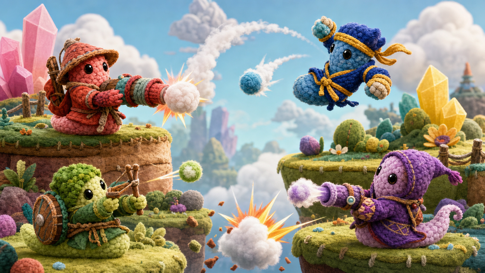
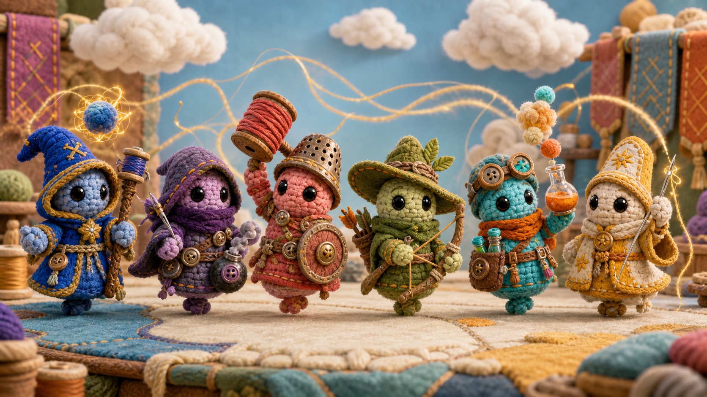
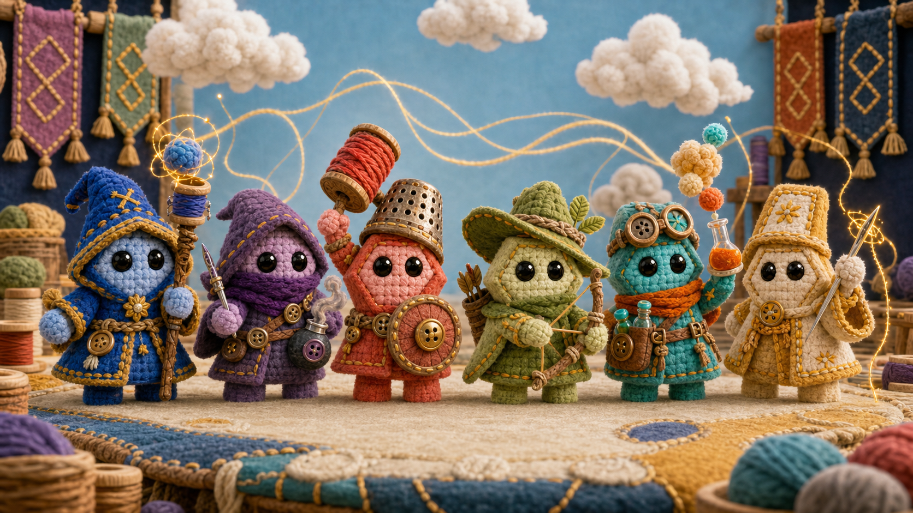

# NIMble Knots World And Art Direction

Status: active concept direction for WP-003. This document defines the current
creative boundary. It does not approve concept images or Nimiq brand elements
as runtime product assets.

## Product Identity

- Game: **NIMble Knots**
- Subtitle: **Cotton Clash**
- Tagline: **Soft heroes. Epic clashes.**
- World: **The Patchwork Realms**
- Creatures: **Knotkin**
- Teams: **Guilds**
- Matches: **Clashes**
- Battlefields: **Patches**
- Character roles: **Callings**
- Magic and life force: **NIM Thread**
- Special abilities: **NIMbursts**
- Weapons and tools: **Relics**
- Health: **Stitching**
- Defeat: **Unraveling**
- Revival: **Restitching**
- Winner title: **Grand Knot**

Repository and upstream provenance may continue to use `Worms_Port`,
`TurtlePU/worms-ii`, and other historical names where accuracy requires them.
They are not the user-facing product identity.

## Core Fantasy

NIMble Knots is a playful fantasy artillery game about tiny handcrafted heroes
fighting spectacular comic battles. The confrontation and shooting mechanics
remain central. The re-theme must not turn the project into a robot, racing,
salvage, or non-combat game.

The Patchwork Realms are floating lands made from felt, yarn, cotton, wood,
buttons, and embroidery. NIM Thread is a luminous golden force that binds the
world together, gives Knotkin life, powers magic, and restitches defeated
fighters. Rival Guilds clash over magical spools, Loomstones, and Relics.

Combat is dramatic but not graphic. Impacts create cotton bursts, thread
spirals, embroidered marks, and comic reactions. A defeated Knotkin unravels
into fluff and thread and can later be restitched.

## Knotkin Anatomy

All Knotkin share one readable species silhouette:

- a broad angular hexagonal head-and-torso with a flat crown,
- chamfered cheeks and sloped shoulders,
- short angular arms,
- a narrow lower bridge,
- two separate stubby rectangular feet,
- exactly two oversized glossy black bead eyes,
- no mouth, nose, eyebrows, or other facial marks.

The shape is inspired by the user-supplied Nimiq emoticon reference. It must be
expressed as soft three-dimensional anatomy, not printed as a Nimiq logo.
Emotion comes from eye angle, body tilt, pose, costume, and animation.

Costumes may exaggerate a Calling but must not hide the shared body silhouette.
The design must remain readable at mobile-game scale.

## Callings

- **Wizard:** folded hood, spool staff, pom-pom spells, tangled lightning.
- **Thief:** low hood, long scarf, needle grappling tool, button smoke bombs.
- **Warrior:** felt armor, thimble helmet, button shield, spool hammer.
- **Ranger:** stitched hat, twig-and-thread bow, yarn quiver.
- **Alchemist:** stitched goggles, dye flasks, glue traps, cotton mixtures.
- **Cleric:** layered robes, repair thread, protective patches, needle wand.

These are visual and gameplay archetypes, not imports from Sorcerers. Sorcerers
may inform high-level gameplay observation only; its code, costumes, artwork,
audio, names, and other assets remain quarantined.

## Material Language

- Bodies use chunky chenille crochet with visible stitches and cotton stuffing.
- Clothing uses felt, woven yarn, embroidery, cords, and tassels.
- Hardware uses wooden buttons, spools, beads, buckles, and polished thimbles.
- Terrain uses layered felt, tufted yarn grass, cotton clouds, and stitched
  edges.
- Damage tears, compresses, scorches, and releases stuffing instead of
  simulating realistic soil or injury.
- Equipment is oversized and toy-like. Avoid realistic firearms and military
  camouflage.

## Nimiq Visual Reference

The art direction translates the [Nimiq Style reference](https://nimiq.github.io/submodules/style/demo.html)
into physical materials rather than copying a flat interface into the world.

- Nimiq Blue `#1F2348`: structural textiles, deep shadows, framing.
- Nimiq Light Blue `#0582CA`: interactive magic and high-energy accents.
- Nimiq Gold `#E9B213`: NIM Thread, rewards, premium details.
- Nimiq Green `#21BCA5`: healing and alchemy.
- Nimiq Orange `#FC8702`: impact energy and warm hero accents.
- Nimiq Red `#D94432`: warrior and danger accents.
- Nimiq Purple `#5F4B8B`: stealth and trickster magic.
- Nimiq Pink `#FA7268`: playful secondary accents.
- Nimiq Light Green `#88B04B`: ranger and natural materials.
- Nimiq Brown `#795548`: wood, leather-like felt, and neutral hardware.

The palette should remain varied and tactile. Nimiq logos, icons, fonts, CSS,
and other brand files are not approved product inputs merely because they are
visible in the public style reference. Exact license or written brand-use
permission is required before importing them.

## Nimiq Reward Loop

The current competition-safe concept uses a sponsor or community-funded
**Prize Loom**, not player-funded winner-takes-all deposits.

1. Players connect a wallet and sign a match challenge.
2. Their signed NIM Threads weave their Knotkin into the Patch.
3. Both players enter with equal conditions and no at-risk player stake.
4. Deterministic Thread Sparks power abilities during the Clash.
5. The winner may claim a fixed, disclosed NIM reward from the Prize Loom.
6. Players may optionally send a post-match **Honor Thread** tip.

Escrow, betting, chance-based payouts, and player-loss-funded rewards are out of
scope unless competition approval, legal review, security review, and explicit
rules are obtained.

## Current Concept Artwork

The retained images record the concept progression. All three are
documentation-only and must not be referenced by runtime code or moved into
`assets/` without completing the product asset gate.

### Cotton Material And Battle Study

This exploration established tactile crochet terrain, cotton-puff projectiles,
comic fantasy confrontation, and readable class colors. Its elongated body
shapes are superseded and are not canonical Knotkin anatomy.

### Fantasy Calling Study

This exploration established the Wizard, Thief, Warrior, Ranger, Alchemist,
and Cleric lineup. Its rounded doll anatomy predates the Nimiq-inspired body
shape and is superseded.

### Current Knotkin Direction

This image establishes the current canonical concept for Knotkin anatomy,
material treatment, fantasy Callings, and Nimiq-derived palette.

### Concept Provenance

- `docs/images/art-direction/cotton-clash-battle-study.png`
  - Output SHA-256:
    `32F5672F5901B717DD7814040A51BFCE9194A200C6B613E388FB4BF830B555E8`
  - User-supplied cotton/crochet reference SHA-256:
    `0B0BB0502382167D52E599FD7A2AEE30A5FD03F5D371D0B043E4DE02A7ED47C7`
  - User-supplied Nimiq emoticon reference SHA-256:
    `FD99E18A96BF6CA12748A8B320AE6B3088EE37B1E2FAC387EE627E938CC04E9F`
- `docs/images/art-direction/knotkin-calling-lineup-study.png`
  - Output SHA-256:
    `27E3E7CED3D1453BF4EF68CF65F8E825F2C783E71708B4D6B57C55CEF05299DD`
  - OpenAI-generated material/class reference SHA-256:
    `32F5672F5901B717DD7814040A51BFCE9194A200C6B613E388FB4BF830B555E8`
- `docs/images/art-direction/knotkin-class-lineup-concept.png`
  - Output SHA-256:
    `B4B9B1E676E7DD5CD13F7ABB2B63048884D209295379FCC10347348F80D5FD46`
  - User-supplied Nimiq shape reference SHA-256:
    `1D86C3C01A75BD99FE918BDE6356EBB336FCA90F3E12FD58F6EF15F6247F1497`
  - Prior OpenAI-generated Calling study SHA-256:
    `27E3E7CED3D1453BF4EF68CF65F8E825F2C783E71708B4D6B57C55CEF05299DD`
  - Style reference:
    `https://nimiq.github.io/submodules/style/demo.html`

All three were generated on 2026-07-10 with OpenAI built-in image generation
under TasirWimp's authoring direction. OpenAI output terms do not by themselves
grant rights to third-party brands represented in input references. Nimiq
brand-use rights and exact final-asset provenance must be confirmed before
product approval. No Sorcerers material was used.

The earlier Pocket Robot asset is a superseded import-workflow trial and is not
part of the NIMble Knots art direction. Removing it from runtime and replacing
it with approved Knotkin production assets belongs to a later implementation
slice.

## Art Boundary

Required:

- cute cotton Knotkin with the shared angular anatomy,
- big eyes and no mouth,
- readable fantasy Callings,
- playful artillery confrontation,
- tactile crochet, felt, cotton, and stitched terrain,
- strong mobile-scale silhouettes,
- per-file commercial-use and redistribution evidence for production assets.

Blocked:

- Worms or Team17 character silhouettes, names, UI, or branded visual motifs,
- Sorcerers code, artwork, costumes, audio, or copied character designs,
- realistic violence, gore, firearms, or grim military presentation,
- robots as the canonical player characters,
- unlicensed Nimiq brand assets or an implication that the game is an official
  Nimiq product,
- concept art entering runtime without an approved asset-manifest entry.

## Open Decisions

- Confirm written permission or an applicable license for Nimiq-inspired body
  geometry and any official brand elements used in the final product.
- Decide whether each player controls one Knotkin or a small Guild roster.
- Define the first production-ready Calling and animation set.
- Define the first Patch and its destructible-material behavior.
- Confirm Prize Loom funding and payout architecture with competition
  organizers before implementation.
