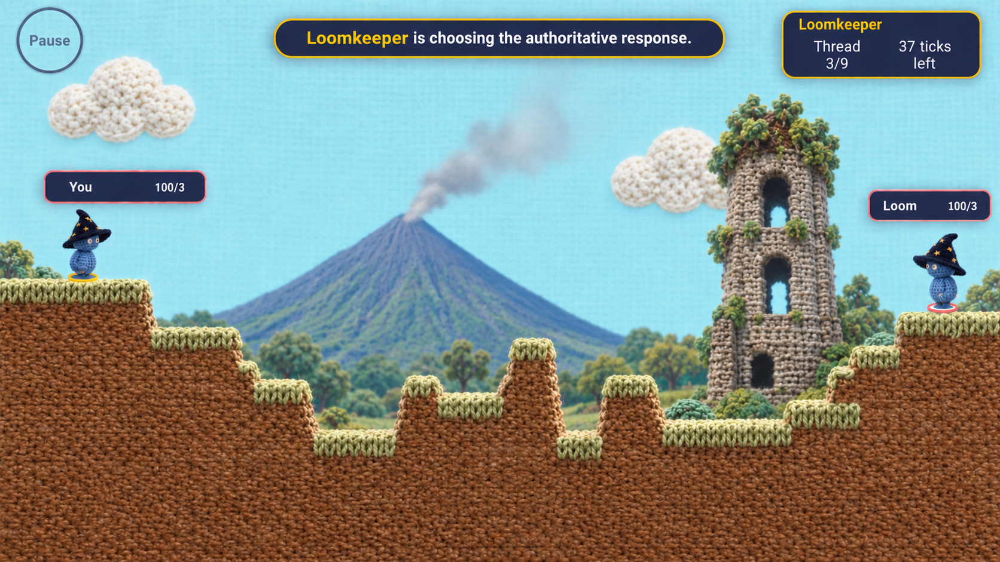

# Volcanic-Ruin Background Scene Preparation

Status: the owner approved the first isolated volcanic-cone source master on
2026-09-09. It has no runtime path. V10G closed with this portable brief
committed; active preparation now continues as
[`WP-015D4E`](../../planning/wp-015d4e-volcanic-ruin-background-contract.md)
on `codex/volcanic-ruin-background-art`, not as part of the closed V10G
terrain/weapon gate.

## Purpose And Boundary

Prepare a scalable, decorative background scene for a later engineering preview:
a textile volcanic cone, a historic stone tower ruin, and tropical vegetation.
The scene must remain independent of `PackedTerrain`, collision,
destruction, spawn selection, projectile authority, AI, replay bytes, and
public Practice/Daily selection.

The first cone is approved as a source master only at
`assets/masters/environment/backgrounds/volcanic-ruin/volcanic-cone-source-master-v1.png`.
The owner also approved the generic Cagsawa-inspired stone tower as a source
master only at
`assets/masters/environment/backgrounds/volcanic-ruin/stone-tower-source-master-v1.png`.
Neither creates a runtime path, build copy, renderer code, or player-visible
change. Jungle, palm, and bush families remain preparation-only.

## Owner-Provided Visual Reference



| Field | Value |
| --- | --- |
| File | `docs/images/art-direction/backgrounds/volcanic-ruin-scene-reference-v1.png` |
| SHA-256 | `9A3E5DEDDF02B0C03B2A8E46894ED61158DB39D8471BA99CD42B8618A1EB0D04` |
| Bytes | `2,323,466` |
| Role | Owner-provided composition, textile-material, depth, and readability reference only; owner authorizes later FLUX conditioning of these exact bytes |
| Excluded pixels | UI, text, characters, status panels, existing Patch terrain, clouds, and all other composited elements |

The reference must never be copied, cropped, shipped, or treated as a product
asset. The owner authorized later FLUX conditioning of this exact file on
2026-09-09. A future conditioned request must still bind its exact source hash,
staging path, workflow hash, prompt, seed, output hash, and job ID, and pass
the generation-component, output-rights, and visual/IP review gates.

The intended geographic read is a generic tropical volcanic landscape with a
historic stone tower ruin. It must not copy a particular photograph, painting,
map, branded location artwork, or the reference's UI/character composition.

## Scene Grammar

```text
camera
  L3 sparse near vegetation accents
  L2 stone tower ruin and nearer foliage
  L1 volcanic cone, smoke, and distant jungle
  L0 code-owned sky and existing cloud sprites
  authoritative PackedTerrain and actors
```

`PackedTerrain` remains the sole surface, collision, crater, and support truth.
The new scene may suggest a horizon but must never align decorative pixels to a
terrain recipe or respond to terrain destruction.

## Planned Asset Inventory

Every candidate starts from the existing pinned `flux2-klein` profile's
1024x1024, batch-one workflow, then remains in external quarantine until
review. The listed runtime paths are placeholders, not admissions.

| Family ID | Planned isolated content | Layer | Later placement rule |
| --- | --- | --- | --- |
| `volcanic-ruin-bg-volcanic-cone-v1` | One textile volcanic cone with a small subdued smoke plume | L1 | Stable landmark, normalized arena X, scale by viewport height only |
| `volcanic-ruin-bg-stone-tower-v1` | One weathered textile stone bell-tower ruin with restrained vines | L2 | Stable right-side landmark, scale by viewport height only |
| `volcanic-ruin-bg-distant-jungle-a-v1` through `-c-v1` | Three low-contrast distant jungle clusters | L1 | Fixed-seed horizon scatter; no individual landmark claim |
| `volcanic-ruin-bg-palm-cluster-a-v1` through `-b-v1` | Two sparse near palm/tree clusters | L3 | Fixed-seed scatter outside actor/trajectory contrast band |
| `volcanic-ruin-bg-bush-cluster-a-v1` | One low foreground bush cluster | L3 | Fixed-seed sparse scatter; never an obstacle or cover claim |

Reuse the current code-owned sky fill and approved cloud family. Do not
regenerate terrain top or terrain interior for this work.

## Request And Review Contract

Each asset requires its own later request contract. It must define a unique
seed, full prompt, negative constraints, source/reference mode, expected
transparent subject bounds, anchor, normalized master dimensions, and one-shot
or explicitly bounded retry policy.

All requests must block: text, UI, status panels, characters, weapons,
projectiles, foreground terrain, landscape frames, logos, watermarks, branded
game art, photo replication, a copied reference composition, and Sorcerers or
other third-party material. The volcano, tower, and foliage must be generated
as separate assets; no request may ask for a whole battlefield background.

The current reference-edit workflow is technically pinned but its prior
authorization is closed. A new manifest amendment and reviewed request contract
are required before staging this reference or calling either FLUX workflow.
Text-only generation remains an alternative only if a later contract explicitly
chooses it; the existing cloud/ground requests used that text-only route.

Candidates are rejected if they contain an opaque background, multiple intended
subjects, a non-isolated terrain silhouette, copied UI/characters, legibility
conflicts near the horizon, or recognizable third-party visual material.

## Deterministic Processing And Runtime Preconditions

Accepted candidates need a new frozen normalizer configuration per family. It
may perform only source verification, fixed white-matte extraction where
applicable, alpha-edge decontamination, connected-subject selection, uniform
scale, fixed translation, and deterministic PNG encoding. It may not paint,
clone, infer, warp, generate a missing region, or merge distinct candidates.

The result must pass full-size and phone-size alpha/edge review. Volcano and
tower anchors must preserve their aspect ratio; vegetation masters need safe
padding for flip/scale reuse. All decorative assets remain behind actors and
trajectories, with a deliberately lower-contrast horizon band.

The current eleven-asset WP-015C runtime inventory is closed at 1,402,579 bytes
under a 1,500,000-byte initial-media ceiling. Before any source-master
promotion, a separate loading and budget decision must establish whether this
background is lazy-loaded, which existing inventory rule changes, and how the
new byte budget and fallback behavior are tested. No background runtime path is
admitted by this brief.

## Later Integration Contract

A later implementation slice must use an explicit `BackgroundScene` definition
with normalized landmark anchors, height-derived landmark scale, and seeded
scatter. It must not use `Math.random`, terrain pixels, or simulation state as
an art-generation input. Intended parallax is bounded: sky `0`, volcano/jungle
about `0.05–0.12`, tower about `0.18`, near vegetation about `0.30–0.35`, and
terrain/actors `1`.

That slice must preserve the current V10G terrain map recipes and rules,
provide an asset-missing fallback, verify all maintained phone viewports, and
run the applicable compliance, budget, build, browser, visual-baseline, and
physical-device gates.

## Re-entry Checklist

1. Record owner permission to submit the exact reference image to the selected
   FLUX workflow, or select a text-only route.
2. Add a new generation-manifest authorization and one request contract for the
   first isolated asset only.
3. Run profile preparation/hash verification; stage only the exact approved
   reference if conditioning is selected.
4. Generate one quarantined candidate, complete IP/art/alpha review, and stop
   on rejection unless its contract permits a bounded retry.
5. Author and test the asset-specific normalizer before manifest promotion.
6. Resolve the initial-media loading and budget contract before runtime copying
   or renderer integration.
