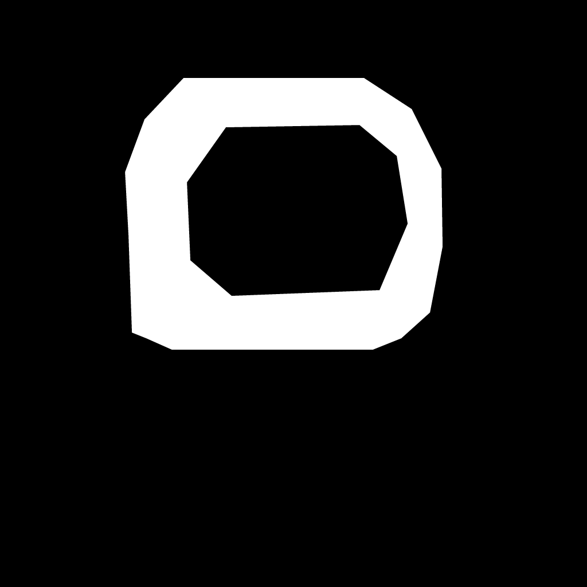
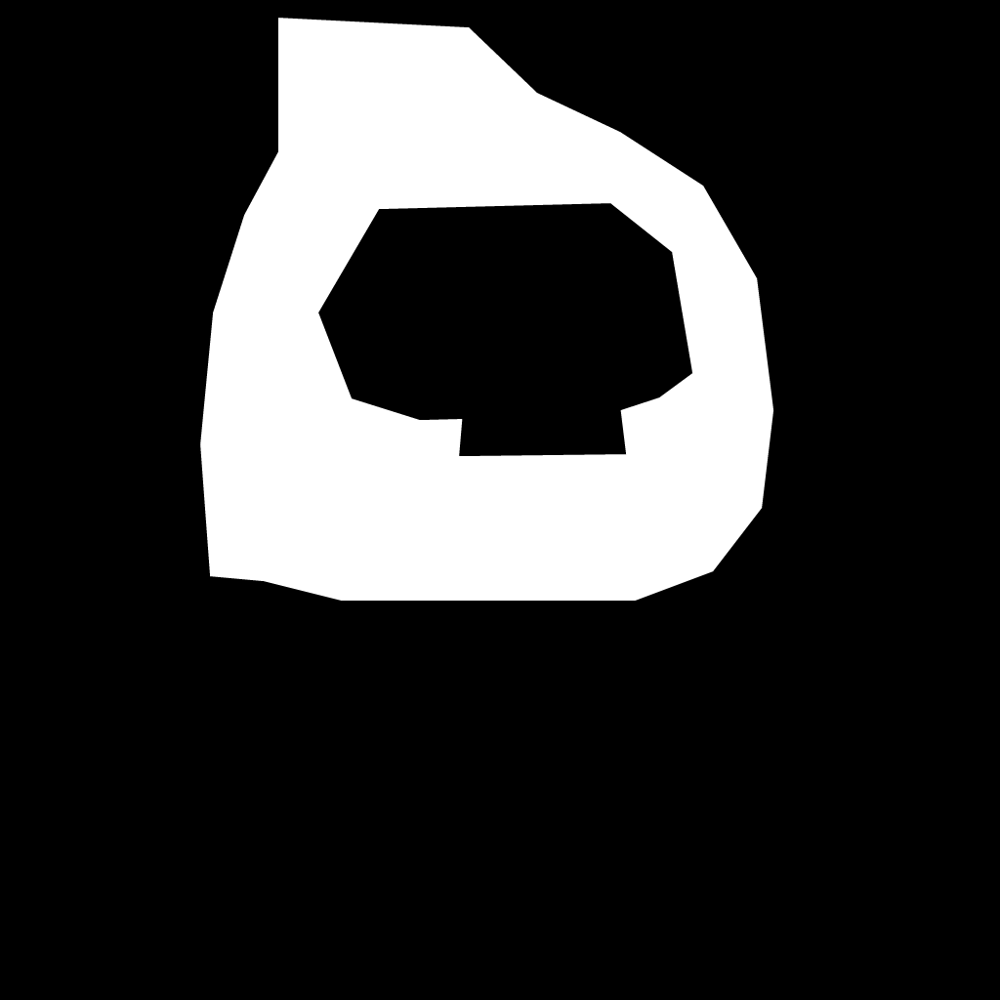

# WP-015B2 Quarantined Generation Review

Status: in progress. No file recorded here is an approved product asset.

## Frozen Inputs

- Starting commit: `1eaf731`
- B1 contract: `docs/asset-briefs/wp-015b1-vertical-slice.md`
- B1 contract SHA-256:
  `5A323A12BF3C3238179C624D3B87DEA9F0AA3D80B7FD974B51A30CC174B9862E`
- Checkpoint SHA-256:
  `E9476A13728CD75D8279F6EC8BAD753A66A1957CA375A1464DC63B37DB6E3916`
- Text workflow SHA-256:
  `968A5B78766549BBAF374C1C27BE80B75E6BB389A01CCC237639DFB4EFCF3CD5`
- Initial settings: 512x512, 28 steps, CFG 7, Euler, normal scheduler,
  denoise 1.0, batch size 1.
- External output root:
  `C:/Users/jensb/AppData/Local/Comfy-Desktop/ComfyUI-Shared/output`

`Prepare`, `Status -VerifyHashes`, and `Start` passed before generation. ComfyUI
0.27.1 used the AMD Radeon RX 7600 through the pinned loopback MCP bridge. No
Sorcerers, Worms/Team17, official Nimiq brand file, or unrecorded conditioning
input was used.

## Primary Attempt

The dedicated `generate_image` tool received the exact B1 prompts, settings,
and seeds. All files remain untouched in external quarantine.

| Purpose | Seed | File / SHA-256 | Asset / prompt ID | Decision |
| --- | ---: | --- | --- | --- |
| Wizard | `15015001` | `ComfyUI_00002_.png`, 564653 bytes, `ABD455783DE51F33EAE87BFFABA217FE39AE85BD8C2F1FE8A96B2D904A17D434` | `8506d11f-b6d5-44f6-ae9e-3064425146e6` / `d00515db-f6a0-4eb0-b507-6a9ae55ffd52` | reject |
| Loomkeeper | `15015002` | `ComfyUI_00003_.png`, 468129 bytes, `35EEB5F047B78C57EB6728299B43ADC422DA488019F1A78FE221CDE20A2AAE66` | `db2dd982-ead4-4030-8744-a3753da00acc` / `9c2f6188-0f1e-43db-b0f6-f210ce0925d1` | reject |
| Threadball | `15015003` | `ComfyUI_00004_.png`, 385051 bytes, `3F4B5B7A657127978347A7BDBD3DF7AB4DAB2E28BDE8B71C2A77B33007693069` | `cd8860e3-40e9-4915-8ab3-3bccef862e18` / `25523409-6d57-418d-b634-5db3e99eea62` | reject |
| Patch cloud | `15015004` | `ComfyUI_00005_.png`, 302917 bytes, `811A37F2570630AF9FB871799950634098025A4342A6B06A28D4D38180474C3A` | `55787cf7-0b4a-4ce5-b91e-1a3fc1fb7441` / `4928027f-291f-4c6f-bb66-c5e70e121526` | reject |
| Patch terrain top | `15015005` | `ComfyUI_00006_.png`, 490007 bytes, `EEEB59B29BACDDD5BD6127EFD6A7693C620800505F17AF1871D83B22977157F9` | `64fe9eca-b003-4dc4-9262-1fdcd63bcee1` / `d179dc79-e634-493e-8bcf-ce090f7773d9` | reject |
| Patch terrain interior | `15015006` | `ComfyUI_00007_.png`, 543755 bytes, `2DD3006A1C8788CABF10BB1ACE11557BB378143DB57B566B46C8DD6CC3BA8542` | `ec65fd70-ba77-4d8a-9ddf-daaf3e2b7ca4` / `1a62c9ab-0f43-4a62-945c-f41f0eaca6bd` | reject |

Review findings:

- Wizard has only one visible eye, rounded doll anatomy, no usable side-view
  hand socket, the wrong body/costume balance, and a textured contact backdrop.
- Loomkeeper is a hanging elongated plush object rather than a character; it
  has no face, eyes, limbs, feet, baseline, or held-Relic socket.
- Threadball is a readable round yarn ball but lacks the required gold-thread
  identity and uses a realistic floor, background, and contact shadow.
- Patch cloud contains multiple disconnected clouds against a dark scene rather
  than one isolated low horizontal layer.
- Patch terrain top is a full green corduroy-like field without the brown felt
  edge or gold stitched boundary.
- Patch terrain interior is directionally usable brown crochet, but its opposite
  edge mean RGB differences are 29.91 horizontally and 36.55 vertically. The
  visible repeat and edge mismatch fail the 3x3 seamless-material gate.

## Retry 1 Prompt Amendment

Retry 1 changes prompts only. It keeps the same purpose seed, checkpoint,
workflow, dimensions, steps, CFG, sampler, scheduler, and denoise. The shorter
SD 1.5 prompts emphasize the failed structural requirements. This is a recorded
amendment, not seed shopping or relaxed acceptance.

### Wizard retry 1

Positive:

```text
(one full-body cute crochet fantasy game character:1.4), (right-facing three-quarter side view:1.3), (two large glossy black bead eyes visible:1.5), (no mouth:1.4), (angular hexagon-shaped head and torso:1.5), flat crown, chamfered cheeks, short arms, narrow lower bridge, two separate block feet, pale sky-blue chenille yarn body, deep navy folded felt wizard hood, gold blanket stitching, wooden button, small spool staff strapped behind the back, empty front hand for a separate game item, centered, full feet on one baseline, tactile yarn and felt, strong mobile game silhouette, isolated on a plain uniform warm-white background, generous padding, soft studio light
```

Negative:

```text
two characters, multiple characters, front view, rear view, left-facing, single visible eye, missing eye, mouth, nose, eyebrows, round human head, long dress, fused legs, missing feet, extra limbs, cropped body, scenery, textured backdrop, floor, contact shadow, text, watermark, signature, logo, official Nimiq logo, worm, slug, robot, gun, gore
```

### Loomkeeper retry 1

Positive:

```text
(one full-body cute crochet fantasy game character:1.4), (right-facing three-quarter side view:1.3), (two large glossy black bead eyes visible:1.5), (no mouth:1.4), (angular hexagon-shaped head and torso:1.5), flat crown, chamfered cheeks, short arms, narrow lower bridge, two separate block feet, chunky purple chenille yarn body, short coral felt keeper mantle, asymmetrical folded cowl, dark woven sash, small wooden buttons, restrained gold stitching, empty front hand for a separate game item, calm friendly competitive pose, centered, full feet on one baseline, tactile yarn felt and wood, strong mobile game silhouette, isolated on a plain uniform warm-white background, generous padding, soft studio light
```

Negative:

```text
hanging ornament, cocoon, keychain, faceless object, two characters, multiple characters, front view, rear view, left-facing, single visible eye, missing eye, mouth, nose, eyebrows, wizard hat, crown, long dress, fused legs, missing feet, extra limbs, cropped body, scenery, wood wall, textured backdrop, floor, contact shadow, text, watermark, signature, logo, official Nimiq logo, worm, slug, robot, weapon, gun, gore
```

### Threadball retry 1

Positive:

```text
(one single round yarn ball:1.5), (thick sky-blue chenille yarn:1.3), (three thin luminous golden thread wraps crossing around the ball:1.5), compact balanced spherical textile game projectile, visible soft fibers, clean round silhouette, medium visual weight, centered isolated object, plain uniform warm-white background, generous padding, soft studio light, no floor and no shadow
```

Negative:

```text
plain blue ball without gold, multiple balls, character, hand, face, needle, spool, bomb, grenade, fuse, spikes, fire, explosion, orbit, cage, logo, official Nimiq logo, text, watermark, scenery, floor, tabletop, horizon, contact shadow, long trail, motion blur, cropped object, hard plastic, metal sphere
```

### Patch cloud retry 1

Positive:

```text
(one single connected low horizontal cotton cloud:1.6), one compact cluster of overlapping soft white cotton pompoms, handcrafted textile game environment layer, rounded uneven silhouette, centered isolated object, solid uniform pale-blue background, generous padding, gentle even studio light, subtle cotton fibers, no face and no scenery
```

Negative:

```text
multiple separate clouds, second cloud, scattered balls, character, face, eyes, landscape, horizon, dark sky, black background, gradient background, floor, contact shadow, dramatic lighting, text, watermark, signature, logo, official Nimiq logo, frame, cropped cloud
```

### Patch terrain-top retry 1

Positive:

```text
(flat orthographic textile game texture:1.3), (one straight horizontal terrain edge crossing completely from left to right:1.6), upper area made from short tufted light olive-green yarn grass, lower area made from warm brown felt, one narrow row of small regular golden blanket stitches exactly along the horizontal boundary, even density and lighting across both side edges, no hills, no objects, no scenery
```

Negative:

```text
vertical stripes, corduroy, full green field, all grass, no brown felt, missing stitch line, hills, curve, landscape perspective, horizon sky, character, weapon, object, central motif, frame, outer border, text, watermark, signature, logo, official Nimiq logo, hard plastic, metal
```

### Patch terrain-interior retry 1

Positive:

```text
(seamless tile:1.6), uniform dense warm-brown looped crochet and felt game terrain material, flat top-down orthographic texture, small irregular textile fibers, restrained tiny gold stitches distributed evenly, identical visual density and lighting at every edge, no central motif, no directional pattern, fills the complete square
```

Negative:

```text
visible seam, border, frame, grid, repeating squares, rosette, central flower, large motif, vertical stripes, horizontal stripes, directional lighting, vignette, object, character, face, landscape, sky, grass, rocks, text, watermark, signature, logo, official Nimiq logo, hard plastic, glossy metal
```

## Retry 1 Results

Retry 1 used the amended prompts above and otherwise preserved every frozen
parameter. All outputs are rejected and remain untouched in external
quarantine.

| Purpose | File / SHA-256 | Asset / prompt ID | Decision |
| --- | --- | --- | --- |
| Wizard | `ComfyUI_00008_.png`, 593572 bytes, `7AFE93089AF565BBDD58A6E12C05245FDD2C7265EAAFF16D9FBC8C5AB5686AB7` | `52ae5c4d-3f5f-4f54-bab4-bbd2cdabb8d2` / `c73a5db3-baa8-422a-bf5b-adcd4630f644` | reject |
| Loomkeeper | `ComfyUI_00009_.png`, 362697 bytes, `6D1EF870F06C649FA69B58D70B526B3ABF10F2545558C1F607DF2F2B0C70C64E` | `15cd3bad-6275-4171-b11b-c29f3eccdde2` / `b134d563-4d8b-4cb5-b785-81abe8c82efe` | reject |
| Threadball | `ComfyUI_00010_.png`, 452580 bytes, `4F6CACDF120D1ECAB259252417DC7164F32A34993477FB15DC3ABDE2EB7E189A` | `ff7d905f-13b7-43be-80ad-a7c0ef467155` / `d5527de8-19b4-4274-b1da-0b78adebe750` | reject |
| Patch cloud | `ComfyUI_00011_.png`, 376975 bytes, `419D8CF404135840DA9F6AEADD844DDD6D6A2083B2206BE0C4AEBB5FFB295C5B` | `c96fc44e-5e4f-49bb-8c40-f6bb785b3a01` / `ab275252-4b8d-4f27-9d65-eacafd419150` | reject |
| Patch terrain top | `ComfyUI_00012_.png`, 480077 bytes, `10F8BB1A3957B7F94821DA52384EF78BB61820675A97E25E679721270FA2ED89` | `b240471b-f3de-4932-aab8-dfeb7745ca12` / `0002bace-17aa-418f-8c46-5dec6eaf20d9` | reject |
| Patch terrain interior | `ComfyUI_00013_.png`, 582833 bytes, `B1C4DFD5310AFCF8B7322B759D8B3C746427E89FC5A69EFFA1A21BE6EB280624` | `9e2d0fe5-a718-4980-adb6-221045256571` / `d8d9fd88-0785-4c76-96d8-3d2f6e85ba4d` | reject |

Review findings:

- Wizard collapsed into a dark hexagonal crochet patch with no character,
  anatomy, eyes, limbs, feet, costume, or socket.
- Loomkeeper became a cropped human-proportioned hooded figure with a face,
  oversized hand, black clothing, missing feet, and a geometric scene.
- Threadball contains three gold balls on a blue floor rather than one blue ball
  with restrained gold wraps.
- Patch cloud became a full-frame cotton texture with dark scene remnants rather
  than one isolated cloud.
- Patch terrain top became a brown geometric lattice without green yarn grass,
  felt, or the requested stitched material boundary.
- Patch terrain interior became a geometric repeating panel rather than crochet
  material. Opposite-edge mean RGB differences worsened to 49.30 horizontally
  and 80.35 vertically.

## Retry 2 Conditioned Amendment

Blind text-only retry is stopped. Retry 2 evaluates the reviewed
`generate_image_conditioned` workflow using exact, quarantined outputs only as
composition guides. Every guide remains rejected as a product master; staging
does not approve it. This amendment preserves the original purpose seeds and
Retry 1 prompts, uses 24 steps, CFG 6, Euler, and the normal scheduler, and
records family-specific denoise before execution.

| Purpose | Exact guide | Guide SHA-256 | Denoise |
| --- | --- | --- | ---: |
| Wizard | `ComfyUI_00002_.png` | `ABD455783DE51F33EAE87BFFABA217FE39AE85BD8C2F1FE8A96B2D904A17D434` | `0.60` |
| Loomkeeper | `ComfyUI_00009_.png` | `6D1EF870F06C649FA69B58D70B526B3ABF10F2545558C1F607DF2F2B0C70C64E` | `0.60` |
| Threadball | `ComfyUI_00004_.png` | `3F4B5B7A657127978347A7BDBD3DF7AB4DAB2E28BDE8B71C2A77B33007693069` | `0.35` |
| Patch cloud | `ComfyUI_00005_.png` | `811A37F2570630AF9FB871799950634098025A4342A6B06A28D4D38180474C3A` | `0.55` |
| Patch terrain top | `ComfyUI_00012_.png` | `10F8BB1A3957B7F94821DA52384EF78BB61820675A97E25E679721270FA2ED89` | `0.55` |
| Patch terrain interior | `ComfyUI_00007_.png` | `2DD3006A1C8788CABF10BB1ACE11557BB378143DB57B566B46C8DD6CC3BA8542` | `0.35` |

The characters need higher denoise because the guide anatomy fails. Threadball
and terrain interior use the reviewed default to preserve their useful round
and textile structure. Cloud and terrain top use a bounded midpoint to preserve
composition while replacing failed scene/material content. A Retry 2 output
must still satisfy the original B1 acceptance criteria; no criterion is relaxed.

## Retry 2 Stop Record

The user stopped Retry 2 after recognizing that the local image model cannot
reliably follow the current number of simultaneous details. The orchestration
cell was terminated immediately. ComfyUI then reported zero running and zero
pending jobs.

One Wizard job had already completed before termination:

- File: `WormsPortConditioned_00002_.png`
- Bytes: 591372
- SHA-256:
  `F246DD12A61F84C5BD4C80060B97C66D1DEB86015B1DF41ADDB72D515DD444DA`
- Asset ID: `61b6e1c5-8d1d-4a04-b658-a0d3b07d43c8`
- Prompt ID: `c9c4e11d-287e-4ac0-85d4-00728441d362`
- Reference: `wormsport/wp015b2-wizard-primary.png`
- Settings: seed `15015001`, 24 steps, CFG 6, Euler, normal scheduler,
  denoise `0.60`.
- Decision: reject. It retains the rounded doll/dress structure, obscures the
  required two-eye face, lacks the angular Knotkin anatomy and usable forward
  socket, and preserves the textured contact background.

No Loomkeeper, Threadball, cloud, terrain-top, or terrain-interior conditioned
output completed in Retry 2. Generation remains paused. The next amendment must
split visual goals into short, staged prompts and test one asset at a time before
submitting another batch. Existing rejected files may be analyzed, but no new
generation occurs until that prompt refinement is reviewed.

## Approved Planning Deviation: WP-015B2A Model Admission

Decision date: 2026-08-02. Starting review record: `2c528b8`.

The prompt-only retries and conditioned Wizard diagnostic show that prompt
decomposition by itself is not a sufficient next step for the approved SD 1.5
route. The final sentence of the stop record above is therefore superseded only
for execution order: generation stays paused while a bounded FLUX.2 Klein 4B
distilled FP8 model-admission gate runs first. The rejected SD 1.5 files,
settings, prompts, seeds, and decisions remain immutable evidence; the proposed
route is not yet an approved generation component.

The deviation preserves the B1 product requirements for anatomy, side view,
eyes, baseline, sockets, projectile origin, animation triggers, environment
decomposition, phone readability, and exact-output review. It does not carry
the B1 SD 1.5 prompts, seeds, CFG, sampler, scheduler, or workflow settings into
a different architecture. If the new route passes admission, a separate
model-specific short staged prompt/settings/seed amendment must be reviewed
before B2 candidate generation resumes.

Admission proceeds in this exact order:

1. Review and exact-hash the external distilled FP8 diffusion model, Qwen3 4B
   text encoder, and FLUX.2 VAE with canonical-source and commercial-use
   license evidence. A mirror without exact license/provenance linkage fails.
2. Review and exact-hash bounded text-to-image and single-reference-edit
   workflows using only the pinned ComfyUI 0.27.1 core nodes. Do not update
   ComfyUI, install custom nodes, or use a cloud generation API.
3. Extend the local tooling with a fail-closed separate model profile. Preserve
   the existing SD 1.5 smoke route and reject arbitrary component or workflow
   selection.
4. Prove a batch-one technical smoke on the actual Windows AMD Radeon RX 7600
   8 GB route using low-VRAM text-encoder offload and disabled previews. Record
   exact settings, runtime, memory behavior, output hash, and failures. The
   published FP8 figure is about 8.4 GB on an RTX 5090, so local compatibility
   is a gate rather than an assumption.
5. Only after technical admission, run one Wizard structure pass, one
   Threadball structure pass, and at most one controlled reference edit with
   short staged prompts. Review after every output; do not batch the remaining
   purposes.
6. Record an explicit adopt/reject decision. Only an adopted route may receive
   the model-specific prompt amendment and resume B2 generation.

Model generation will not be treated as proof of seamless terrain, exact
transparent edges, repeatable tiling, or collision geometry. Those properties
remain deterministic postprocess or code-owned responsibilities. This planning
deviation downloads, generates, promotes, and approves nothing by itself.

## WP-015B2A Gate 1 Result: Exact Components

Review date: 2026-08-03. Status: **pass with a canonical encoder
substitution; FLUX route still not approved**.

The three external component files admitted for the next native-workflow review
are:

| Role | Reviewed external file | Bytes | SHA-256 | Exact source relation |
| --- | --- | ---: | --- | --- |
| Distilled FP8 diffusion model | `flux-2-klein-4b-fp8.safetensors` | 4,070,624,520 | `97ED34FE0567E436200F2FAEE3939B88F2B5D99F8AF2A4DC16532C4245C0CCB6` | exact canonical BFL file at `5b4408e59397a4a37ccb46afe426d8ed86379441`, Apache-2.0 |
| Qwen3 4B text encoder | `qwen_3_4b_bfl_apache.safetensors` | 8,044,982,048 | `AD65083F0B6561CC84B9B6A42FF397EE749171E367C28D800C4A6FD612ABC169` | deterministic single-file repackage of the two canonical BFL Klein 4B shards at `e7b7dc27f91deacad38e78976d1f2b499d76a294`, Apache-2.0 |
| FLUX.2 VAE | `flux2-vae.safetensors` | 336,213,556 | `D64F3A68E1CC4F9F4E29B6E0DA38A0204FE9A49F2D4053F0EC1FA1CA02F9C4B5` | exact canonical BFL FP32 VAE at `26afe3a78bb242c0a8bb181dcc8937bb16e5c66c`; BFL's pinned `flux2` README licenses the FLUX.2 autoencoder under Apache-2.0 |

The encoder repackage has two exact inputs:

- `model-00001-of-00002.safetensors`, 4,967,215,360 bytes, SHA-256
  `8C0506E7F4936FA7E26183A4FD8DA4E2BDBC5990BA64AE441F965D51228F36EA`;
- `model-00002-of-00002.safetensors`, 3,077,766,632 bytes, SHA-256
  `82F2BD839378541B0557BFABAF37C7D3D637071FDCB73302DEDD7CF61162CE07`.

The merge removes only the safetensors `__metadata__` records, shifts the
second shard's data offsets by the first shard's data length, writes one
compact eight-byte-aligned combined header, and concatenates the two source
data regions without conversion. Independent post-build comparison passed for
all 398 tensor names, shapes, dtypes, and per-tensor raw SHA-256 values.

The official Comfy guide's pre-release mirror
`qwen_3_4b.safetensors`, SHA-256
`6C671498573AC2F7A5501502CCCE8D2B08EA6CA2F661C458E708F36B36EDFC5A`,
is explicitly rejected. It was uploaded before the BFL Klein release, has no
exact license/provenance declaration, and differs from both the canonical BFL
and Qwen bytes in `model.layers.35.mlp.down_proj.weight` and
`model.layers.35.mlp.up_proj.weight`. It must not be substituted into the
reviewed route merely because the official Comfy tutorial links to it.

The VAE's exact hash is present in BFL's canonical `FLUX.2-dev` repository.
Its 251 tensor names and shapes also match the Apache Klein 4B VAE: projecting
each of the 250 FP32 floating tensors to BF16 reproduces the Klein tensor
exactly, while the I64 state matches directly. This evidence is limited to the
autoencoder; it does not admit any non-autoencoder `FLUX.2-dev` weight.

External evidence is preserved below
`E:\ComFy\TasirWimp\component-evidence\wp-015b2a`. The admitted files are
installed at:

```text
E:\ComFy\TasirWimp\Worms_Port-models\diffusion_models\flux-2-klein-4b-fp8.safetensors
E:\ComFy\TasirWimp\Worms_Port-models\text_encoders\qwen_3_4b_bfl_apache.safetensors
E:\ComFy\TasirWimp\Worms_Port-models\vae\flux2-vae.safetensors
```

The ignored local `E:\ComFy\TasirWimp\ComfyUI\extra_model_paths.yaml`
registers those three E: subdirectories while retaining the Comfy Desktop shared
root for the approved SD 1.5 route, inputs, and outputs. Its reviewed SHA-256 is
`D03C5A366C7291F161B30DDB6CF5002800B67380E6D32D7DCC410AEFD1B4A00D`.
The repository pipeline preflight pins that hash and fails closed on path drift.

Gate 1 approves only those exact external bytes for Gate 2 workflow
construction. It does not approve either FLUX workflow, the pipeline profile,
RX 7600 compatibility, prompt settings, generation, output, or product-media
promotion. The next bounded action is to construct, inspect, exact-hash, and
register native ComfyUI 0.27.1 text-to-image and single-reference-edit graphs
without updating ComfyUI or installing custom nodes.

## WP-015B2A Gate 2 Result: Native Core-Node Workflows

Review date: 2026-08-03. Status: **pass as non-executable source tooling;
FLUX route still not approved**.

Gate 2 translated the distilled graphs from the official Comfy workflow
templates at exact revision
`cebdebc9fc2febcb97a5db0dd291f59f5300b176` into project-owned Comfy API
format. The translations replace the template encoder mirror with the reviewed
canonical-shard merge and bind all three Gate 1 filenames exactly:

| Mode | Project source | Nodes | SHA-256 |
| --- | --- | ---: | --- |
| Text to image | `scripts/comfy-workflows/generate_flux2_klein_text.json` | 13 | `626568CEAA47627F7D421D3BD1B0AA151E1643DBA8FBD631F5EB437666649E28` |
| Single-reference edit | `scripts/comfy-workflows/generate_flux2_klein_reference_edit.json` | 19 | `A2BF8CD3C015D36646E73F2FA87F22741E4410D27B26D562331057B49CFF6C8E` |

Both graphs fix the distilled route to four steps, CFG 1, Euler, batch size
one, `flux-2-klein-4b-fp8.safetensors`,
`qwen_3_4b_bfl_apache.safetensors`, and `flux2-vae.safetensors`. The text graph
fixes the canvas and scheduler to 1024x1024. The edit graph accepts one
explicitly staged reference filename, scales it to one megapixel using
`nearest-exact`, derives the output dimensions from that bounded image, and
uses the native `ReferenceLatent` conditioning structure. It does not expose a
second reference, denoise control, arbitrary model choice, custom node, or
workflow selector.

Every node class, required input, and connected output/input type was checked
against the running pinned ComfyUI 0.27.1 `object_info` schema. The exact model
filenames were also visible to `UNETLoader`, `CLIPLoader`, and `VAELoader`.
No prompt was submitted and no FLUX model was loaded for inference.

The manifest records both workflows with `runtime_enabled: false`. Their
runtime targets are intentionally absent from the external MCP `workflows`
directory, and the pipeline still exposes only the established SD 1.5 route.
Gate 2 therefore approves exact source graphs for Gate 3 integration review;
it does not approve execution, hardware compatibility, prompt settings,
generated output, or product media.

Before this review, the three verified failed-download directories below
`E:\ComFy\TasirWimp\hf-cache`, `hf-downloads`, and `hf-verified` were removed,
reclaiming about 8.94 GiB. The reviewed model store and
`component-evidence\wp-015b2a` were preserved.

The next bounded action is Gate 3 only: add a separate fail-closed FLUX profile
to the local pipeline, keep the SD 1.5 route intact, verify the full component
and workflow chain before staging runtime copies, and reject arbitrary model or
workflow selection. Do not run the RX 7600 technical smoke until that profile
passes its own tooling and compliance checks.

## WP-015B2A Gate 3 Result: Closed Runtime Profiles

Review date: 2026-08-03. Status: **pass without inference; FLUX hardware route
still not approved**.

Gate 3 adds exactly two manifest-defined runtime profiles:

| Profile | Exact model chain | Exact workflow chain | Required MCP tools | Launch mode |
| --- | --- | --- | --- | --- |
| `sd15` | archived SD 1.5 checkpoint | pinned generic text graph plus project VAE img2img graph | `generate_image`, `generate_image_conditioned` | existing pinned launcher |
| `flux2-klein` | Gate 1 diffusion, encoder, and VAE | Gate 2 text and single-reference graphs | `generate_flux2_klein_text`, `generate_flux2_klein_reference_edit` | `--lowvram --preview-method none` |

The pipeline parameter accepts only those two names. It runs the generation
manifest compliance check before copying, rejects an unknown profile, maps
each reviewed component kind to one fixed external model directory, verifies
model size on every action, and verifies model SHA-256 during `Prepare`,
`Start`, `Smoke`, or `Status -VerifyHashes`. Each workflow source and runtime
copy is exact-hashed. The bridge's allowed untracked paths now contain only its
virtual environment, logs, and the three exact project workflow copies.

Local non-inference integration produced these results:

- `Prepare -Profile sd15` verified the original checkpoint and both original
  workflows. Its two MCP tools remained registered.
- `Prepare -Profile flux2-klein` verified all 12.45 GB of reviewed FLUX model
  bytes and installed both exact workflow copies. It truthfully reported the
  old process as not profile-ready before restart.
- `Start -Profile flux2-klein` safely restarted the reviewed loopback ComfyUI
  and MCP processes. Runtime status reported ComfyUI 0.27.1, AMD Radeon RX 7600
  native, LOW_VRAM launch readiness, and both exact FLUX tools registered.
- A subsequent exact SD 1.5 status check passed, demonstrating that the old
  route and default checkpoint were not replaced.
- An arbitrary profile name failed parameter validation before script work.
- The Comfy queue remained empty. The newest external output stayed
  `WormsPortConditioned_00002_.png` from
  `2026-08-02T19:31:17.8169394Z`; Gate 3 wrote no generated image.

The FLUX workflows are now executable only through the closed reviewed profile,
but no inference has occurred. Gate 3 does not establish that the 8 GB GPU can
load or sample the complete chain. The next bounded action is one Gate 4
fixed-seed technical text-to-image smoke. It must record runtime and memory
behavior plus the exact quarantined output; it must not evaluate the B1 art
briefs, use reference editing, or trigger product promotion.

## WP-015B2A Gate 4 Result: RX 7600 Technical Smoke

Review date: 2026-08-03. Status: **technical pass; hardware route admitted,
visual route not adopted**.

Exactly one MCP generation request ran through the closed `flux2-klein`
profile. There was no retry, reference input, reference-edit call, asset prompt,
seed search, or second queued job. Its fixed contract was:

| Field | Value |
| --- | --- |
| MCP tool | `generate_flux2_klein_text` |
| Prompt | `WP-015B2A Gate 4 technical smoke: one flat cyan circle centered on a plain white background` |
| Prompt ID | `54eb2c85-54dc-44a9-a036-07f4fa2f8bd0` |
| Seed | `15025000` |
| Canvas / batch | 1024x1024 / 1 |
| Schedule | 4 FLUX.2 scheduler steps, CFG 1, Euler |
| Launch boundary | `--lowvram --preview-method none`, inline preview disabled |

ComfyUI reported terminal `success` after 254.42 seconds. Its log recorded the
Qwen text encoder loaded on CPU, the diffusion model loaded partially with
2,964.02 MB resident, 918.00 MB offloaded, and a 243.00 MB reserved buffer, and
the 160.31 MB VAE loaded completely. Sampling itself completed four of four
steps in about 7.56 seconds; most wall time was initial component loading and
offload work. There was no OOM, node error, cancellation, alternate model,
workflow fallback, or cached-node reuse.

The system-stat sample began with 20,469,755,904 bytes of free host RAM and
observed a minimum of 4,422,750,208 bytes. The extended driver sample observed
4,820,218,368 bytes as its minimum free VRAM. The same driver later reported a
free-VRAM value above its nominal total, so those VRAM samples are approximate
operational telemetry; the Comfy load/offload log is the stronger evidence for
the actual execution plan. These measurements describe this Windows driver and
process state and are not a general minimum-hardware claim.

The one saved output is external quarantine evidence only:

```text
C:\Users\jensb\AppData\Local\Comfy-Desktop\ComfyUI-Shared\output\WormsPortFlux2KleinText_00001_.png
1024x1024, 423534 bytes
SHA-256 CFCDDB3E74B1B3B2E1082571BA54F0F37F603E563902B6DDB8397DEA7C1516F4
```

The PNG signature and dimensions passed validation, and the final Comfy queue
contained zero running and zero pending jobs. It was not copied to `assets/`,
entered in the product asset manifest, or judged against the Wizard,
Threadball, or Patch briefs.

The MCP bridge returned an interim `running` response after its internal
30-second history window and logged that expected warning while the same Comfy
prompt continued. This was not treated as success until terminal Comfy history
reported completion. The pipeline smoke helper now polls that same prompt ID
to a terminal success/error/timeout state while continuing telemetry; it never
automatically retries or cancels a timed-out prompt.

Gate 4 therefore proves that the exact reviewed chain can complete one
batch-one generation on the local RX 7600 8 GB route. It does not prove useful
art-direction following, transparent extraction, repeatability across drivers,
reference-edit quality, route adoption, or product-asset approval. The next
bounded action is Gate 5 only: run and review one short-prompt Wizard structure
pass, then run and review one short-prompt Threadball structure pass. At most
one controlled reference edit may follow a clearly diagnosed failure; no other
purpose or batch may be queued.

## WP-015B2A Gate 5 Visual Admission Contract

Contract date: 2026-08-03. Status: **Wizard primary approved to run; no later
Gate 5 request is pre-approved**.

Gate 5 tests whether the technically admitted FLUX route follows the two most
important structure classes with materially shorter prompts than the rejected
SD 1.5 route. It is a visual micro-bakeoff, not B2 production resumption. The
canonical lineup remains a documentation-only art-direction reference; neither
primary pass conditions on it or copies its pixels.

The sequence is fail-closed:

1. run the Wizard primary below and record terminal evidence;
2. review it at 1024x1024 and a 48-pixel-tall phone preview;
3. only after that decision, add and run the Threadball primary contract; and
4. only after both primary reviews, decide whether one controlled reference
   edit has a specific testable purpose. Otherwise record it as not used.

### Wizard structure primary

| Field | Frozen value |
| --- | --- |
| MCP tool | `generate_flux2_klein_text` |
| Seed | `15025001` |
| Settings | 1024x1024, batch 1, 4 FLUX.2 scheduler steps, CFG 1, Euler |
| Runtime | closed `flux2-klein`, `--lowvram --preview-method none`, no inline preview |
| Reference input | none |

Exact prompt:

```text
One isolated full-body game character on a plain white background: a cute blue crochet Wizard with a broad angular hexagonal head-and-torso, flat crown, short arms, narrow lower bridge, and two separate rectangular feet on one baseline. Right-facing three-quarter side view, both glossy black bead eyes visible, no mouth. Folded dark-blue felt hood with gold stitching; empty forward hand. No staff, Relic, text, logo, scenery, shadow, or second character.
```

This first pass evaluates only the structure necessary to justify continuing:
one complete subject; right-facing side-biased pose; exactly two readable bead
eyes and no mouth; angular shared Knotkin anatomy; separated baseline feet;
Wizard hood/palette; a clear empty forward hand; and an isolated background.
It does not require final fiber fidelity, staff/belt/button detail, exact socket
coordinates, alpha, animation readiness, or product-asset polish. Failure does
not authorize a new prompt, new seed, or immediate reference edit.

Wizard primary result: **reject as product structure; sufficient instruction
following to continue the separate Threadball purpose test**.

| Evidence | Recorded value |
| --- | --- |
| Prompt ID | `34c39230-baf7-4a48-9a11-fe0fd8c1a63f` |
| Terminal state / helper wall time | Comfy `success` / 253.52 seconds |
| External output | `WormsPortFlux2KleinText_00002_.png`, 1024x1024 opaque RGB PNG, 759,137 bytes |
| SHA-256 | `D097705B08A4895ACCCA9D91B34B64039CACE893857E0BF688D54CA326481962` |
| Cached invariant nodes | model, encoder, VAE, latent canvas, sampler, scheduler |
| Sampled memory | host free minimum 4,480,778,240 bytes; driver free-VRAM minimum 3,019,488,768 bytes |

The output contains one complete right-facing blue crochet Wizard on an
isolated white field. Both bead eyes, hood identity, complete feet, and overall
silhouette remain readable in the exact 48x48 review derivative at
`E:\ComFy\TasirWimp\component-evidence\wp-015b2a\gate5\wizard-15025001-48px.png`
(SHA-256
`FFFEC34E99A9DA356B14D644DA0D61962ABE00E4CA08F714F523952F688D3084`).
This is materially better structural instruction following than the rejected
SD 1.5 Wizard outputs.

It still fails three decisive requirements: the model added a visible mouth;
the head, torso, and waist remain rounded doll anatomy rather than the broad
angular Knotkin body with a narrow lower bridge; and neither front limb forms a
clearly usable empty held-Relic hand/socket. The feet are separated but rounded,
and a soft floor shadow is present. No output is approved or promoted. These
failures are recorded without changing the prompt or seed and provide a
specific possible reference-edit hypothesis only after Threadball review.

### Threadball structure primary

Wizard review closes the prerequisite for this second and final text primary.
Its independently frozen contract is:

| Field | Frozen value |
| --- | --- |
| MCP tool | `generate_flux2_klein_text` |
| Seed | `15025002` |
| Settings | 1024x1024, batch 1, 4 FLUX.2 scheduler steps, CFG 1, Euler |
| Runtime | closed `flux2-klein`, `--lowvram --preview-method none`, no inline preview |
| Reference input | none |

Exact prompt:

```text
One isolated game projectile on a plain white background: a single centered spherical ball of chunky sky-blue chenille yarn, wrapped by three thin luminous gold threads. Clear round silhouette, visible soft fibers, balanced medium weight, generous empty padding. No character, hand, face, floor, cast shadow, trail, explosion, text, logo, fuse, or second object.
```

This pass evaluates one complete centered object, round readability at 28x28,
soft wound-yarn material, a few gold wraps that read as thread rather than a
logo/fuse/orbit, no baked trail or impact, balanced medium-weight identity, and
an isolated field. It does not require alpha, exact derivative sizing, final
fiber cleanup, trail/impact derivatives, or product polish. Failure does not
authorize a prompt or seed change.

Threadball primary result: **pass for Gate 5 structure; exact output remains
quarantined and unapproved as product media**.

| Evidence | Recorded value |
| --- | --- |
| Prompt ID | `9c00e7df-6055-42fa-b635-04754bfce2ae` |
| Terminal state / helper wall time | Comfy `success` / 256.92 seconds |
| External output | `WormsPortFlux2KleinText_00003_.png`, 1024x1024 opaque RGB PNG, 956,917 bytes |
| SHA-256 | `2BAE664F7E5A862BCB53B55A68071580485CE040A89650C68EC6FA398F4089EB` |
| Cached invariant nodes | model, encoder, VAE, latent canvas, sampler, scheduler |
| Sampled memory | host free minimum 4,483,756,032 bytes; driver free-VRAM minimum 4,746,548,224 bytes |

The output is one complete centered, circular, sky-blue chenille ball with a
small set of distinct gold thread wraps. It has generous clean padding, no
character, frame, trail, impact, fuse, or second object, and its round blue/gold
identity survives the exact 28x28 review derivative at
`E:\ComFy\TasirWimp\component-evidence\wp-015b2a\gate5\threadball-15025002-28px.png`
(SHA-256
`D70B0E51E91B3198C948DA3DC9A6C23AD4DE57148B0CB278443365F47F641452`).
The gold is restrained thread rather than a logo or electrical orbit, and the
object reads as balanced rather than needle-fast or spool-heavy. Final alpha,
exact derivative cleanup, IP/output approval, and promotion remain later gates.

### Wizard controlled reference edit

Both primary purposes have now been reviewed. Threadball passed, while the
Wizard primary established one bounded correction hypothesis. Gate 5 therefore
uses its single optional reference edit on the exact rejected Wizard primary;
the multi-character canonical lineup is not used as an input.

| Field | Frozen value |
| --- | --- |
| MCP tool | `generate_flux2_klein_reference_edit` |
| Reference source | exact `WormsPortFlux2KleinText_00002_.png` bytes, SHA-256 `D097705B08A4895ACCCA9D91B34B64039CACE893857E0BF688D54CA326481962` |
| Seed | `15025003` |
| Settings | one-megapixel reference bound, batch 1, 4 FLUX.2 scheduler steps, CFG 1, Euler |
| Runtime | closed `flux2-klein`, `--lowvram --preview-method none`, no inline preview |

Exact edit prompt:

```text
Edit the referenced Wizard character. Preserve its blue crochet material, dark-blue gold-stitched hood, full-body right-facing pose, two bead eyes, separated feet, single-subject composition, and white background. Change only its anatomy: remove the mouth; reshape the head and torso into one broad angular hexagonal form with a flat crown and narrow lower bridge; shape the forward arm into a clear empty hand. No staff, Relic, text, logo, or scenery.
```

The edit passes only if it keeps the already successful isolation, side bias,
eyes, hood identity, materials, and feet while removing the mouth and visibly
improving both shared Knotkin geometry and the empty forward-hand read. It is
not a general beautification pass. Failure closes Gate 5 without another
generation, seed, prompt rewrite, or reference.

Controlled edit result: **reject**.

`StageInput` copied the exact Wizard primary bytes to
`wormsport/wizard-gate5-primary.png` and returned the reviewed
`generate_flux2_klein_reference_edit` workflow. Source and staged SHA-256 both
equal `D097705B08A4895ACCCA9D91B34B64039CACE893857E0BF688D54CA326481962`.

| Evidence | Recorded value |
| --- | --- |
| Prompt ID | `5f649423-e441-40eb-a871-384aaccf2677` |
| Terminal state / helper wall time | Comfy `success` / 297.30 seconds |
| External output | `WormsPortFlux2KleinReferenceEdit_00001_.png`, 1024x1024 opaque RGB PNG, 1,129,517 bytes |
| SHA-256 | `9ACE9858AA1D81C5381548DF7473857C13EE83E4B90D9D8D6B5E8638B0B5A1CD` |
| Cached invariant nodes | model, encoder, VAE, sampler selection |
| Sampled memory | host free minimum 4,625,379,328 bytes; driver free-VRAM minimum 2,840,247,808 bytes |

The edit preserved a single complete right-facing blue crochet character, two
eyes, separated feet, hood identity, and the white field, and it successfully
removed the mouth. Its exact 48x48 review derivative is
`E:\ComFy\TasirWimp\component-evidence\wp-015b2a\gate5\wizard-edit-15025003-48px.png`
(SHA-256
`11ED5D7BD73F66730BFC8A0C044CE2186191A7F6B69B5E780828B081509B94CF`).

The body remains a rounded head over an oval doll torso rather than one broad
angular hexagonal Knotkin form with a narrow lower bridge. Both limbs remain
simple rounded arms; the forward limb does not provide a clear empty hand or
held-Relic socket. The hood also gained a second peak without solving the body
geometry. The edit therefore fails the frozen correction hypothesis. No second
edit, new seed, prompt rewrite, or alternate reference is allowed.

## WP-015B2A Gate 5 and Gate 6 Decision

Decision date: 2026-08-03. Status: **technical route retained for evidence;
general visual route rejected**.

Gate 5 completed exactly three sequential, reviewed requests:

1. Wizard text primary: rejected for mouth, rounded anatomy, and unusable hand;
2. Threadball text primary: passed its bounded structure purpose; and
3. the one allowed Wizard reference edit: removed the mouth but still failed
   angular Knotkin anatomy and forward-hand structure.

All three reached terminal success without OOM, node error, cancellation,
retry, seed shopping, workflow fallback, or a second queued job. Their outputs
and phone-scale derivatives remain external quarantine evidence. Nothing was
copied below `assets/`, added to the product asset manifest, or approved as a
production master.

Gate 6 requires both visual purposes to pass before the route can resume B2
candidate generation. Threadball alone is insufficient, so the closed
`flux2-klein` profile is not adopted as the general WP-015B2 asset route. Its
technical compatibility and stronger isolated-object performance remain useful
evidence for a future separately reviewed Relic-only route, but they do not
authorize more generation now.

The next bounded action returns to planning only: choose a character-master
construction route capable of enforcing angular Knotkin geometry, exact facial
features, and deterministic held-Relic sockets. Do not generate Loomkeeper,
Patch, animation, roster, or another Wizard/Threadball candidate until that
route and any narrower FLUX use are explicitly reviewed.

## WP-015B2B Deterministic Structure-Reference Recovery

Contract date: 2026-08-03. Status: **completed; bounded structure purpose
failed; further generation blocked pending a new reviewed plan**.

### Reviewed correction hypothesis

The B2A controlled edit asked FLUX to replace anatomy while simultaneously
preserving the rejected rounded Wizard that supplied all reference tokens. The
new experiment changes the structural input rather than adding prompt detail:

- use a clean project-owned anatomy and pose guide as the only reference;
- retain the exact B2A single-reference graph and admitted model chain;
- describe only desired content in a 67-word positive prompt;
- test one new fixed seed; and
- evaluate structure before material polish, alpha, animation, or promotion.

This follows BFL's official FLUX.2 structural-reference and positive-prompt
guidance. It does not authorize a ControlNet, custom node, ComfyUI update,
larger/Base model, cloud API, full-lineup input, multi-reference graph, or a
second request.

### Exact conditioning guide

| Field | Frozen value |
| --- | --- |
| Input ID | `knotkin-wizard-structure-guide-v1` |
| Source | `docs/images/art-direction/knotkin-wizard-structure-guide.png` |
| Generator | `scripts/generate-wizard-structure-guide.js` |
| PNG | 1024x1024 opaque RGBA, 15,044 bytes |
| PNG SHA-256 | `5A8F1C1D0942755F113327467462D47812A22A64BAF3DF2C5CD2E0F491FA9AA1` |
| Generator SHA-256 | `695B499E67794692BFEB248C22CA24C24C2D0091107B4EAAE247D29830FCAF63` |
| Geometry | baseline `y=902`; held-Relic socket center `(682,586)` |
| Staged name | `wormsport/wizard-structure-guide-v1.png` |

The guide is rendered solely from project-authored polygons and ellipses. It
contains no generated-art input, canonical-lineup pixels, crop, trace,
Sorcerers/Worms material, or official Nimiq brand file. Its cyan/navy flat
diagram is not an art candidate and may not enter runtime.

### Frozen diagnostic

| Field | Frozen value |
| --- | --- |
| MCP tool | `generate_flux2_klein_reference_edit` |
| Reference | exact staged guide above |
| Seed | `15026001` |
| Settings | one-megapixel reference bound, 1024x1024 canvas, batch 1, 4 FLUX.2 scheduler steps, CFG 1, Euler |
| Runtime | closed `flux2-klein`, `--lowvram --preview-method none`, no inline preview |

Exact prompt:

```text
Image 1 defines the exact silhouette and pose. Preserve its flat-crowned angular head-and-torso, chamfered shoulders, narrow lower bridge, two separate rectangular feet, and forward arm ending in a simple mitten. Render that shape as a blue crochet Wizard with a dark-blue felt hood and restrained gold stitching. The face consists solely of two glossy black bead eyes. One complete right-facing character centered on an unbroken white field.
```

The prompt contains no negative-concept list and does not name the face marks,
props, background content, or other objects it seeks to exclude. The guide
supplies geometry and pose; the prompt supplies Wizard material and Calling
identity.

### Decision rule

Review the untouched 1024x1024 output and an exact 48-pixel-tall derivative.
Pass the bounded structure purpose only if all are true:

- one complete, right-facing, side-biased subject remains isolated;
- the head and torso read as one broad continuous angular form with flat crown
  and visible chamfered sides rather than a round head over an oval torso;
- the lower bridge visibly narrows before two separate block-like feet on one
  baseline;
- exactly two bead eyes remain readable and the rest of the face is unmarked;
- the forward arm ends in a visibly separate simple hand that can normalize to
  the B1 socket without covering an eye; and
- blue crochet plus dark-blue/gold Wizard identity is present without obscuring
  the structure.

Opaque white background or a deterministically removable soft shadow is not a
structure failure, but neither satisfies later alpha/product acceptance. Exact
socket coordinates, fiber polish, staff/belt details, animation, and runtime
normalization remain later work.

After one terminal result, record the prompt ID, output path, dimensions, byte
size, SHA-256, telemetry, queue state, 48-pixel derivative hash, and decision.
No second seed, rewritten prompt, alternate reference, full-lineup reference,
multi-reference extension, Loomkeeper, Patch, animation, or promotion may run
under this contract.

### Recorded result and decision

| Field | Recorded value |
| --- | --- |
| Prompt ID | `6fede7ab-3de4-4d67-9a24-d3de5ea3ca1f` |
| Terminal state | success; queue returned to 0 running / 0 pending |
| Elapsed | 298.335 seconds from Comfy history; server log 298.33 seconds |
| Full output | external `WormsPortFlux2KleinReferenceEdit_00002_.png` |
| Output properties | 1024x1024 opaque PNG; 1,163,317 bytes |
| Output SHA-256 | `FD24C8CD494FD9631BE2BC589067BE8477C67026DC24ED9BA9A9A3A07920570B` |
| 48px evidence | external `E:\ComFy\TasirWimp\component-evidence\wp-015b2b\gate1\wizard-structure-15026001-48px.png`; 48x48; 3,467 bytes |
| 48px SHA-256 | `192209CC0D7121AEDF0CC25CCDD0C807E314A6C0E65E459A83192B7A33D3E925` |
| Runtime telemetry | RX 7600 LOW_VRAM; 2,808.00 MB diffusion loaded, 1,074.02 MB offloaded, 324.00 MB buffer; four Euler steps; no node error or retry |
| Decision | **fail — structure-reference Wizard route rejected** |

The result is one isolated, complete, right-facing blue crochet Wizard with a
dark-blue/gold felt hat, exactly two bead eyes, two readable feet, an unmarked
face, and a separate forward mitten. Those properties and the overall Calling
identity remain legible at 48x48.

The decisive anatomy requirement failed. Instead of retaining the guide's one
broad flat-crowned angular head-and-torso with chamfered sides and a narrow lower
bridge, FLUX generated a pointed hat over a round head and oval doll torso. The
output therefore cannot establish a Wizard master, cannot be promoted, and
remains external quarantine. One terminal result exhausted this contract: no
retry, prompt rewrite, seed change, or second reference was submitted. A future
two-reference structure/style experiment or deterministic character-master
route requires separate planning and approval.

## WP-015B2C Robot-Scaffold Knit Conversion

Contract date: 2026-08-03. Status: **both gates completed and passed; route
evidence retained in external quarantine; further generation blocked**.

### Reviewed hypothesis and boundary

All three FLUX Wizard failures retained a familiar rounded amigurumi prior. The
B2C experiment changes that semantic prior before adding any knitted material:

1. render the exact deterministic guide as a compact faceted mechanical
   scaffold, using no crochet, Wizard, hood, cute, plush, doll, or puffy term;
2. stop immediately if that scaffold does not pass the angular anatomy gate;
3. only after a recorded pass, stage the exact robot bytes and convert materials
   while repeating every silhouette invariant; and
4. compare the untouched robot and knit outputs before any adoption decision.

The robot is a disposable external control image. It is not Knotkin lore,
concept art, a runtime asset, a product candidate, or permission to redesign the
characters as robots. Both outputs remain external quarantine. The project
owner also amends the future character contract to exactly two bead eyes and one
small neutral expression-ready mouth; historical mouthless prompts remain
unchanged evidence and are not reused here.

### Gate 1: mechanical scaffold

| Field | Frozen value |
| --- | --- |
| MCP tool | `generate_flux2_klein_reference_edit` |
| Reference | exact `knotkin-wizard-structure-guide-v1` input, staged as `wormsport/wizard-structure-guide-v1.png` |
| Seed | `15026002` |
| Settings | one-megapixel reference bound, 1024x1024 canvas, batch 1, 4 FLUX.2 scheduler steps, CFG 1, Euler |
| Runtime | closed `flux2-klein`, `--lowvram --preview-method none`, no inline preview |

Exact 61-word prompt:

```text
Image 1 defines the exact silhouette and pose. Render its flat-crowned continuous angular head-and-torso, chamfered shoulders, narrow lower bridge, two separate rectangular feet, and forward articulated hand as a compact blue mechanical automaton. Use planar painted-metal panels, crisp beveled edges, two glossy black circular eyes, and one small neutral mouth slot. One complete right-facing character centered on an unbroken white field.
```

Gate 1 passes only when the untouched full output and exact 48x48 derivative
both show one complete isolated right-facing subject; one broad continuous
flat-crowned faceted head-and-torso; visible chamfered sides and narrow lower
bridge; two separate rectangular feet on one baseline; a protruding articulated
forward hand; exactly two eyes; and one small neutral mouth. Mechanical material
quality is secondary. A round head over an oval torso, domed crown, missing
bridge/hand/foot, additional face feature, or small-scale silhouette collapse
fails the gate.

One terminal Gate 1 result exhausts its authorization. A failure closes B2C and
blocks Gate 2. A pass must be recorded with prompt ID, dimensions, bytes, hash,
telemetry, queue state, and derivative hash before the manifest can transition
to the Gate 2 authorization.

#### Gate 1 recorded result

| Field | Recorded value |
| --- | --- |
| Prompt ID | `2dfc929f-3370-41e9-a568-4f1a86689c36` |
| Terminal state | success; queue returned to 0 running / 0 pending |
| Elapsed | helper 298.57 seconds; Comfy server 296.06 seconds |
| Full output | external `WormsPortFlux2KleinReferenceEdit_00003_.png` |
| Output properties | 1024x1024 opaque RGB PNG; 644,831 bytes |
| Output SHA-256 | `BC6B21B74C5016504A733D5D1EC306FE7F46A8CC5E526E0FFF28EB9EABC25D38` |
| 48px evidence | external `E:\ComFy\TasirWimp\component-evidence\wp-015b2c\gate1\wizard-robot-scaffold-15026002-48px.png`; 48x48; 2,799 bytes |
| 48px SHA-256 | `3D82FC1A55BC94AFABF1258C6E129F2421390C0FC6FEEECAB244917820A4C2BD` |
| Runtime telemetry | RX 7600 LOW_VRAM; helper driver free-VRAM minimum 3,239,481,856 bytes; server loaded 2,844.00 MB, offloaded 1,038.02 MB, and reserved a 324.00 MB buffer; no sample error or retry |
| Decision | **pass — Gate 2 manifest transition permitted** |

The output proves the semantic-prior hypothesis at the bounded level needed for
Gate 2. It has a flat crown, chamfered planar sides, one angular outer chassis,
a visibly narrowed lower body, two separate rectangular feet, a complete
articulated forward hand, exactly two eyes, and one small mouth slot. The
mechanical panel seam between upper and lower volumes does not divide the outer
silhouette into the previous round head/oval torso anatomy. All controlling
features remain readable at 48x48.

The robot is not accepted product art, does not amend the Knotkin world into a
robot setting, and may be used only as the exact Gate 2 material-conversion
input. Exact hand/socket normalization and removal of mechanical seams remain
later concerns; they do not block this scaffold purpose.

### Gate 2: fitted knit shell (conditional)

Gate 1 passed. Gate 2 becomes executable only after the closed profile records
that result, exact-stages only the output above as
`wormsport/wizard-robot-scaffold-15026002.png`, verifies the source/staged
SHA-256, and reruns all preflight checks. Its frozen seed is `15026003`. Its
exact 67-word prompt is:

```text
Image 1 is the exact mechanical scaffold. Preserve its complete silhouette, scale, pose, planar proportions, flat crown, chamfered sides, narrow lower bridge, rectangular feet, articulated forward hand, two eyes, and small neutral mouth. Change only its materials: every visible surface becomes a closely fitted padded blue crochet shell stretched over the rigid faceted frame, with restrained dark-blue felt and gold stitching. Centered unchanged on the white field.
```

Gate 2 passes only when the knitted result preserves every Gate 1 structural
criterion, keeps exactly two eyes and one small mouth, reads as yarn/felt rather
than exposed machinery, and remains clear at 48x48. In addition to visual
review, compare foreground silhouettes after normalizing both non-white subject
bounds; target at least `0.90` intersection-over-union, no baseline drift beyond
`16` source pixels, and no material-caused loss of the forward hand. The exact
comparator is `scripts/compare-character-silhouettes.js`: an 8-bit RGB/RGBA
pixel enters the subject mask when its maximum channel distance from white is at
least `32`; each foreground bound is normalized to 256x256 before IoU. The
numeric measurement supports rather than overrides the visual gate.

Terms such as `cute doll`, `plush toy`, and `puffy body` remain intentionally
absent because they would reintroduce the rounded prior under test. Gate 2 does
not add a Wizard hat or Calling props; those require a later bounded styling
decision only after geometry and knit conversion both pass. No third request,
prompt rewrite, seed change, multi-reference graph, Loomkeeper, animation,
promotion, or runtime integration is authorized by B2C.

#### Gate 2 recorded result

| Field | Recorded value |
| --- | --- |
| Staged reference | `wormsport/wizard-robot-scaffold-15026002.png`; source/staged SHA-256 `BC6B21B74C5016504A733D5D1EC306FE7F46A8CC5E526E0FFF28EB9EABC25D38` |
| Prompt ID | `936917b2-f182-4cfa-8960-5fccda8cbe0c` |
| Terminal state | success; queue returned to 0 running / 0 pending |
| Elapsed | helper 295.019 seconds; Comfy server 292.55 seconds |
| Full output | external `WormsPortFlux2KleinReferenceEdit_00004_.png` |
| Output properties | 1024x1024 opaque RGB PNG; 1,130,420 bytes |
| Output SHA-256 | `5FF0A63DAC03E13B2A3390AD77E6929A9822412E1A1E0415E7A38125D703B246` |
| 48px evidence | external `E:\ComFy\TasirWimp\component-evidence\wp-015b2c\gate2\wizard-knit-conversion-15026003-48px.png`; 48x48; 3,394 bytes |
| 48px SHA-256 | `9308495013B25771F6B015AC7FD4EE3FC3B76DE4360AAF2A218ED4009D3A7B18` |
| Runtime telemetry | RX 7600 LOW_VRAM; helper driver free-VRAM minimum 2,390,135,808 bytes; server loaded 2,808.00 MB, offloaded 1,074.02 MB, and reserved a 324.00 MB buffer; no sample error or retry |
| Raw-canvas IoU | `0.951554` |
| Bounds-normalized IoU | `0.956188` against required `0.90` |
| Baseline drift | `12` pixels against maximum `16` |
| Numeric decision | pass |
| Visual decision | **pass — robot-scaffold fitted-knit route demonstrated** |

The knit result preserves the robot's flat crown, chamfered planar outer body,
narrow lower section, separate rectangular feet, forward articulated hand, two
eyes, and small mouth. Crochet covers the visible shell and the restrained gold
stitching follows the faceted seams. The silhouette remains clearly angular at
48x48 rather than returning to the earlier round doll anatomy. Numeric overlap
and baseline gates independently agree with the visual review.

This is a route proof, not an approved Wizard master. It remains opaque, retains
construction seams and a rear scaffold volume, has no final Calling cowl or
Relic-socket normalization, and has not passed exact-output IP/product review.
Further work must first adopt the route and freeze a separate Wizard styling and
normalization contract. No third request ran under B2C.

## WP-015B2D Wizard Cuteness And Calling Styling

Contract date: 2026-08-03. Status: **one fixed-seed reference edit completed;
cuteness direction accepted by the project owner; production normalization and
head-worn Wizard cowl remain pending**.

### Adoption decision and scope

The project owner accepts the B2C fitted-knit output as the correct structural
route but finds it less cute than the canonical Calling study. B2D therefore
adopts only its angular silhouette as an edit target. It does not adopt the
robot-like panel construction, rear block, joint language, or mouth slot.

This pass intentionally changes one family of features: friendly facial appeal,
continuous textile construction, and the minimum Wizard Calling treatment.
Cuteness is translated into concrete local cues rather than the generic words
`doll`, `plush`, `puffy`, or a rounded-body request:

- two slightly larger, closer-set glossy bead eyes,
- one tiny upward-curved stitched smile,
- softer pale-blue chenille with continuous crochet rather than panel seams,
- a clean compact back without the scaffold block, and
- a deep-navy folded felt cowl, restrained gold stitching, woven belt, and one
  wooden button, all kept inside the existing angular outline.

Alpha extraction, animation, expression variants, exact hand/socket
normalization, staff/Relic equipment, Loomkeeper generation, other Callings,
and product promotion remain separate later gates. This keeps the request below
the detail load that contributed to earlier model failures.

### Frozen request

| Field | Frozen value |
| --- | --- |
| MCP tool | `generate_flux2_klein_reference_edit` |
| Reference | exact B2C knit output SHA-256 `5FF0A63DAC03E13B2A3390AD77E6929A9822412E1A1E0415E7A38125D703B246`, staged as `wormsport/wizard-knit-proof-15026003.png` |
| Seed | `15026004` |
| Settings | unchanged native single-reference graph; one-megapixel reference bound; 1024x1024 canvas; batch 1; 4 FLUX.2 scheduler steps; CFG 1; Euler |
| Runtime | closed `flux2-klein`, `--lowvram --preview-method none`, no inline preview |
| Request limit | one terminal request; no retry or prompt/seed/reference change |

Exact 84-word prompt:

```text
Image 1 is the exact fitted-knit structure. Preserve its angular silhouette, scale, right-facing pose, flat crown, chamfered body, narrow lower bridge, rectangular feet, and forward hand. Change only styling and expression: soft pale-blue chenille, a close-fitting deep-navy folded cowl inside the outline, exactly two slightly larger close-set glossy bead eyes, one tiny curved stitched smile, restrained gold stitching, a woven belt, and one wooden button. Replace rigid panel seams and the rear block with continuous crochet and a clean back. Center unchanged on white.
```

### Initial narrow decision gate (historical)

The following gate was frozen before seeing the output. It remains recorded for
reproducibility, but the project-owner review below supersedes its treatment of
eyebrows and a single numeric silhouette floor as automatic rejection rules.

The untouched full output and exact 48x48 derivative both must pass:

1. The broad flat crown, chamfered continuous body, narrow lower bridge, two
   separate rectangular feet, right-facing pose, and complete forward hand are
   retained.
2. The deterministic comparator reports bounds-normalized silhouette IoU at
   least `0.90` against the B2C knit proof and baseline drift no greater than
   `16` source pixels.
3. The cowl follows the flat crown and remains within the angular outline; it
   does not become a pointed hat or round hood/head.
4. Exactly two bead eyes and one small mouth remain. The eyes are slightly
   larger/closer and the mouth is a tiny curved textile smile rather than a
   mechanical slot. There is no nose, eyebrow, blush mark, or extra feature.
5. Continuous soft crochet, the clean back, cowl, belt, button, and restrained
   gold stitching replace exposed robotic panel, joint, cavity, and backpack
   language.
6. Compared with the B2C proof, the face and materials read visibly friendlier
   and more endearing at full size and 48px without relying on body rounding.
7. The image contains one complete isolated subject on white with no text,
   logo, official Nimiq asset, scenery, staff, selected Relic, or second figure.

Failure of any controlling criterion rejects the result and closes B2D. A pass
proves the Wizard master direction but still does not approve a product asset.
The next decision after a pass is deterministic production normalization:
socket alignment, alpha, crop/padding, pivot/baseline, and animation-source
planning. It is not another model retry.

### Recorded result

| Field | Recorded value |
| --- | --- |
| Prompt ID | `c82a19fa-6be7-4a30-b193-b9c708638302` |
| Terminal state | success; queue returned to 0 running / 0 pending |
| Elapsed | helper 312.618 seconds; Comfy server 310.13 seconds |
| Full output | external `WormsPortFlux2KleinReferenceEdit_00005_.png` |
| Output properties | 1024x1024 opaque RGB PNG; 887,003 bytes |
| Output SHA-256 | `DEF9265DAA4C6F2799D16870205E2015291E3E4AAE0F61802349C9FD8D56AD00` |
| 48px evidence | external `E:\ComFy\TasirWimp\component-evidence\wp-015b2d\gate1\wizard-cuteness-15026004-48px.png`; 48x48; 2,897 bytes |
| 48px SHA-256 | `AB172F6B365B64093F5E2BE03F4AE2D24623F73E18A881033172ED0DA5A6E8E1` |
| Runtime telemetry | RX 7600 LOW_VRAM; helper driver free-VRAM minimum 3,239,481,856 bytes; server loaded 2,844.00 MB, offloaded 1,038.02 MB, reserved a 324.00 MB buffer; no sample error or retry |
| Raw-canvas IoU | `0.813777` |
| Bounds-normalized IoU | `0.880098` against the initial `0.90` floor |
| Baseline drift | `0` pixels against maximum `16` |
| Initial numeric decision | below the narrow floor; retained as drift telemetry |
| Project-owner creative decision | **accept B2D's cuteness/body direction; continue through a mediated normalization plan** |

The concrete cuteness strategy worked visually. The result is friendlier than
the B2C proof: pale chenille replaces dark rigid panels, the larger close-set
eyes and curved smile read clearly, the back is cleaner, and the cowl, belt,
button, and restrained gold detail establish a warmer handmade identity. It
remains readable at 48x48.

Against the initial narrow gate, FLUX added two stitched eyebrows and narrowed
the body enough to record normalized IoU `0.880098` below `0.90`. The dark
textile also reads primarily as a neck wrap rather than a folded head-worn
Wizard cowl. Those observations remain useful diagnostic evidence.

### Project-owner creative review

The project owner accepts the paired eyebrows because they strengthen cuteness
and accepts the observed body narrowing as normal creative variation within the
recognisable angular Knotkin family. Asset generation is not intended to be
pixel-deterministic. Silhouette comparison therefore becomes drift telemetry:
it may trigger later scale/width compensation or closer visual review, but no
single IoU value automatically rejects art whose protected properties remain
intact.

B2D closes without a retry and its exact output remains external because alpha,
socket normalization, crop/pivot/baseline, animation suitability, and exact-file
product approval are still incomplete—not because its eyebrows or measured
width are unacceptable. The owner-approved appeal cues are the larger close-set
eyes, curved smile, optional paired eyebrows, pale chenille, belt/button, clean
back, and warmer handcrafted character.

## WP-015B2E Protected-Property Masked-Edit Investigation

Status: **one frozen protected edit completed; exact-output project-owner
review rejected it as the next Wizard master; generation closed**.

B2E investigated an interior/region-controlled edit that mediates between B2C's
strong geometry and B2D's accepted cute styling. The goal remains to protect
gameplay and Calling properties without removing FLUX's useful creative
variation:

1. a broad angular Knotkin body family with a flat/chamfered crown, narrow lower
   bridge, and separate feet, allowing moderate local proportion variation;
2. a Wizard cowl/hat visibly resting on the head rather than existing only as a
   neck wrap;
3. a complete forward hand that can be normalized to hold a separate Relic;
4. exactly two bead eyes and one expression-ready mouth, with optional paired
   stitched eyebrows; and
5. a clearly friendly, cute handcrafted character at full size and 48px.

Everything else is a creative field for FLUX: eye spacing and highlights,
eyebrow curve, stitch pattern, textile folds, trim, belt/button treatment,
surface micro-detail, local width, and other non-protected variation. Global
scale, position, baseline, padding, and small width drift are normalization
concerns when they can be compensated without distorting the protected form.

For this single-purpose pass, the creative field is intentionally narrower than
the long-term character doctrine: only the cowl point, folds, trim, stitches,
and local crown/neck shape are editable. The accepted B2D face and all gameplay
anatomy remain outside the mask. A later animation or expression pass may vary
the face deliberately; this cowl repair may not.

### Technical decision

| Candidate | Decision | Reason |
| --- | --- | --- |
| `InpaintModelConditioning` | reject | Adds concat conditioning whose pinned node warning says the noise mask may break depending on the model; no FLUX.2 Klein contract was established. |
| `VAEEncodeForInpaint` | reject | Replaces masked source pixels before VAE encoding; B2E needs B2D to remain the semantic reference and base. |
| `DifferentialDiffusion` | reject | Marked experimental in pinned ComfyUI 0.27.1. |
| custom inpaint/crop, segmentation, ControlNet, or IP-Adapter nodes | reject | Adds an unreviewed dependency and is unnecessary for the bounded cowl hypothesis. |
| `VAEEncode` + `SetLatentNoiseMask` + `ImageCompositeMasked` | select | Uses only pinned core nodes, edits a B2D base latent, and restores pixels outside the same deterministic mask. |

The selected API graph is
`scripts/comfy-workflows/generate_flux2_klein_protected_edit.json`: 23 nodes,
5,626 bytes, SHA-256
`AD4D4F96AD7D7C024A1A903A440DD4FE6D9E31353ACB7E436BF7DFC787321DAA`.
It derives from the same official FLUX.2 Klein 4B distilled image-edit template
revision `cebdebc9fc2febcb97a5db0dd291f59f5300b176` as the admitted full-canvas
edit workflow. It retains the exact three model filenames, four steps, CFG `1`,
Euler sampler, one-megapixel bound, and batch-one input behavior.

The graph changes the edit topology only:

1. B2D is scaled once, VAE-encoded once, supplied as the sole positive and
   negative `ReferenceLatent`, and reused as the sampler's base latent.
2. A second staged image is size-matched and converted from its red channel to
   a mask.
3. `SetLatentNoiseMask` attaches that mask to the B2D base latent.
4. The decoded result is composited onto the bounded B2D pixels using the same
   mask; outside-mask pixels therefore do not depend on latent reconstruction.

B2C is **geometry evidence, not a second model input**. This preserves its role
in human review while avoiding extra reference tokens, memory use, and semantic
competition on the 8 GB GPU. B2D is the edit target, base latent, and sole
style/reference image.

Pinned ComfyUI 0.27.1 `object_info` validation found every class, required
input, and connected edge type valid. The graph contains no
`InpaintModelConditioning`, `VAEEncodeForInpaint`, `DifferentialDiffusion`,
`EmptyFlux2LatentImage`, or custom node. Schema compatibility does not prove
masked-edit image quality.

### Exact mask and regions



The mask is 1024x1024, 11,323 bytes, SHA-256
`2B6C5F51A6EA411BB8B9C40AF861A339622316CB1D9710719F7F0CDEC327425B`.
`scripts/generate-wizard-cowl-edit-mask.js`, SHA-256
`8DFD6623479D61603C046550F9184F13ADAE0C4FA3E40E9C49F2017E6F8634A1`,
regenerates it byte-for-byte. White is editable; black is protected.

- The white outer ring covers B2D's navy wrap and head perimeter and extends
  into the white halo above the crown so a cowl can visibly rest on the head.
- The black central island protects the exact accepted eyes, paired eyebrows,
  mouth, and pale face.
- Black below the cowl boundary protects the body, belt/button, arms, complete
  forward Relic hand, separate feet, and baseline.
- Four-times rendering plus deterministic box downsampling creates only a
  narrow anti-aliased boundary. Any pixel with nonzero mask value belongs to
  the editable transition; all zero-mask decoded pixels must remain equal to
  B2D after the final composite.

The mask geometry was reviewed against external B2C evidence
`5FF0A63DAC03E13B2A3390AD77E6929A9822412E1A1E0415E7A38125D703B246`
and targets external B2D evidence
`DEF9265DAA4C6F2799D16870205E2015291E3E4AAE0F61802349C9FD8D56AD00`.
Neither generated image was copied into the repository.

### Frozen activation candidate

| Field | Frozen value |
| --- | --- |
| Workflow | exact `generate_flux2_klein_protected_edit`; closed-profile registration only |
| Base/reference | exact B2D output `DEF9265D...AD00` |
| Geometry review evidence | exact B2C output `5FF0A63D...B246`; not a model input |
| Mask | exact tracked PNG `2B6C5F51...7425B` |
| Seed | `15026005` |
| Requests | exactly one; project-owner activation approved after source/mask review |
| Output state | completed external quarantine candidate `1275B2BD...D2E0`; no retry |

Frozen prompt:

> Change only the navy knitted neck wrap into a cute Wizard cowl that visibly
> rests on and frames the head, with a soft pointed crown and short neck drape.
> Preserve the pale chenille angular Knotkin body, full pose, complete forward
> hand, belt, button, separate feet, exactly two eyes, paired eyebrows, one
> curved mouth, white background, centered full-body framing, and friendly
> handcrafted appeal. No weapon, staff, extra limb, extra face, floating hat,
> text, logo, or rear shell.

Before execution, preflight must exact-install and register only the reviewed
workflow, stage B2D and the tracked mask under two safe `wormsport/` names,
verify their hashes, verify all model/workflow hashes and the low-VRAM/no-preview
launch, and record a zero-running/zero-pending queue with B2D still newest.

Human acceptance is controlling:

1. the new cowl visibly rests on and frames the head rather than remaining a
   neck-only wrap or floating as a separate hat;
2. the result retains the broad angular Knotkin family, exact two eyes, optional
   paired eyebrows, one mouth, complete forward hand, separate feet, and
   friendly/cute full-size and 48px read;
3. decoded pixels outside every nonzero mask pixel equal B2D after compositing;
4. cowl point, folds, trim, stitches, and bounded local silhouette variation are
   judged creatively, not by a last-pixel target; and
5. silhouette IoU, bounds, position, and baseline remain drift telemetry for
   later normalization, not automatic rejection authority.

One failure closes the gate. It authorizes no retry, seed shopping, mask edit,
second reference, wider region, full-canvas fallback, alpha, animation, socket
normalization, another Calling, or product promotion.

### Single-request result

The exact preflight verified all three model hashes, all three workflow hashes,
the low-VRAM/no-preview launch, all three MCP tool registrations, staged B2D
SHA-256 `DEF9265D...AD00`, staged mask SHA-256 `2B6C5F51...7425B`, an empty
queue, and B2D as the newest output. The sole request then completed as follows:

| Field | Recorded result |
| --- | --- |
| Comfy prompt ID | `d023da3f-77cf-4f05-ae7b-62ce66f1f176` |
| Output | `WormsPortFlux2KleinProtectedEdit_00001_.png` |
| Dimensions / bytes | 1024x1024 / 906000 |
| SHA-256 | `1275B2BD8021EAA5C51AA0606A6CC20BA21B15ED6CEBC4A7C1FC76308BA9D2E0` |
| Runtime | `308.956` seconds |
| Host free RAM minimum | 5386878976 bytes |
| Driver-reported free VRAM minimum | 3232272896 bytes |
| Queue after completion | zero running / zero pending |
| 48px review derivative | external PNG, SHA-256 `92524044C2B65179302D47EFF8092C97534E342C1DEA31F49023EC3C6F5C8964` |

The result passed the hard preservation contract: all `907427` pixels whose
mask red channel is zero match B2D exactly, with zero mismatched protected
pixels and maximum RGB-channel difference zero. Baseline drift is zero;
canvas IoU is `0.897468` and normalized silhouette IoU is `0.840783`. As
approved, those silhouette values are drift telemetry rather than automatic
art rejection.

Preliminary full-size and 48px review passes the bounded purpose. The navy
covering now visibly rests on and frames the head, joins the short neck drape,
and remains legible at gameplay scale. The accepted eyes, eyebrows, mouth,
body, belt/button, forward hand, feet, pose, and baseline are unchanged outside
the mask. The crown is compact and hood-like rather than strongly pointed;
that is a project-owner exact-output review point, not grounds for an automatic
retry. No visible boundary seam invalidates the candidate.

The candidate remains external quarantine and is not in `assets/` or the
product asset manifest. The sole request allowance is consumed. Both local
services are stopped, and no retry, further inference, prompt/seed/mask change,
full-canvas fallback, normalization, alpha, animation, socket work, another
Calling, or product promotion is authorized.

Project-owner review rejects this exact output as the next Wizard master. The
covering respects the mask technically, but the compact crown no longer reads
unmistakably as a Wizard hat and the broad horizontal neck wrap reads
thief-like. The accepted face, mouth, eyebrows, angular body direction, hand,
feet, and friendly appeal remain useful B2D evidence. No second B2E request
ran.

## WP-015B2F Wizard-Hood Source-Review Gate

Status: **one fixed-seed protected edit completed; Wizard hood passes but hard
face/mouth composite seams fail full-size review; generation closed**.

B2F isolates the failed garment problem before spending another request. It
uses exact B2D again, not rejected B2E, and asks the next edit to solve only a
recognisable Wizard hood. A full robe or tunic would add garment anatomy,
body-silhouette, and texture decisions to the same four-step edit, so it is
deferred to a later separate pass after the hood succeeds.

### Exact controls




| Control | Exact evidence |
| --- | --- |
| Generator | `scripts/generate-wizard-hood-structure-controls.js`, 13963 bytes, SHA-256 `3B009E6F4A5908D4BAFA63426E7538F9B59DD2A4A286246FFC2604DCD7D0FB69` |
| Flat structure guide | 1024x1024 PNG, 25382 bytes, SHA-256 `08CB26CE3FAC6605859F9C9B51331351F28F40A005F6A101B2E575D8A56C6AB8` |
| Protected-edit mask | 1024x1024 PNG, 12461 bytes, SHA-256 `AC9F8F101094C5C15361FD24827C4F24B7C52ACBC652000748B209CB5483F56B` |
| Exact external B2D base | `WormsPortFlux2KleinReferenceEdit_00005_.png`, SHA-256 `DEF9265DAA4C6F2799D16870205E2015291E3E4AAE0F61802349C9FD8D56AD00` |
| External deterministic review scaffold | `WormsPortWizardHoodScaffold_v1.png`, 756285 bytes, SHA-256 `A048CA16B249298BBECFAD2F57552B04958E26F766D01F6577D1C6A011A0231C` |
| External 48px scaffold review | 3191 bytes, SHA-256 `DFACDC05E4D2A1E858C4565D678E3731099451973EA7F7EBC650D9C1DF486331` |

The guide defines a tall asymmetric crown whose tip folds backward, an open
face, an open center neck, and two short separated shoulder-mantle flaps. The
mask is a permission region rather than a garment tracing: it leaves room for
FLUX creativity around the crown and folds and opens enough of the old wrap to
remove it completely. Separate protected islands retain the accepted upper
face and mouth; the lower body, forward Relic hand, feet, and baseline remain
protected. When supplied the exact B2D bytes, the generator also creates the
external scaffold and fails if any zero-mask source pixel changes.

### Frozen activation prompt

> Image 1 defines the exact garment structure. Rebuild only its flat garment
> guide as one continuous hand-knitted Wizard hood: a tall asymmetrical pointed
> crown rising clearly above the head, with the tip folding backward, an open
> face aperture, two soft side folds, and a short split shoulder mantle below
> the chin. Use deep indigo-violet chenille with a narrow warm-gold stitched
> edge. The silhouette must read unmistakably as a fantasy Wizard at 48px. Keep
> the surrounding character unchanged. No separate horizontal scarf, beanie,
> balaclava, or thief hood.

This is structure-first wording. It does not ask for generic cuteness, a body
redesign, a full robe, another Relic, or additional facial detail; B2D already
supplies those accepted properties. The existing protected-edit graph remains
the exact activation graph, with the deterministic B2D-derived scaffold as its
sole base/reference and the new mask as its edit permission.

### Review decision required

Before any inference, the project owner must approve all of the following as a
single source gate:

1. the tall pointed hood and split-mantle structure at full size and 48px;
2. the generous mask, including the separate face and mouth protection;
3. the exact B2D-derived scaffold as the sole future base/reference; and
4. the frozen hood-only prompt above.

The project owner approved all four items. The separate activation transition
binds exactly these execution values:

| Field | Authorized value |
| --- | --- |
| Workflow | exact `generate_flux2_klein_protected_edit` graph `AD4D4F96...21DAA` |
| Base/reference | external scaffold `A048CA16...0231C`, staged only as `wormsport/wizard-hood-scaffold-v1.png` |
| Mask | tracked `AC9F8F10...3F56B`, staged only as `wormsport/wizard-hood-edit-mask-v1.png` |
| Seed | `15026006` |
| Prompt | exact frozen hood-only text above |
| Requests | exactly one; no retry |

Preflight must verify every model/workflow/input hash, low-VRAM/no-preview
startup, all three closed-profile MCP tools, an empty queue, and the current
newest-output baseline before submission. Any mismatch closes the gate without
inference. A later robe/tunic pass must receive its own mask, prompt, review,
and request allowance.

### Single-request result

The source checks passed with all 38 tooling tests, complete compliance/type/
server/client build, zero audit vulnerabilities, and zero runtime assets. The
exact preflight then verified all three model files, all three workflow files,
native RX 7600 low-VRAM/no-preview startup, all three MCP tools, both staged
hashes, an empty queue, and B2E `_00001_` as the newest generated-output
baseline.

| Field | Recorded result |
| --- | --- |
| Comfy prompt ID | `1f5fc569-5250-4799-a236-0bb22ba629c8` |
| Output | `WormsPortFlux2KleinProtectedEdit_00002_.png` |
| Dimensions / bytes | 1024x1024 / 920934 |
| SHA-256 | `BE162B61FF38BE0EE2EA58716BDBAF5D2B38F0D8E6608953D2ECA41EFE7AD608` |
| Runtime | `355.120` seconds |
| Host free RAM minimum | 3925364736 bytes |
| Driver-reported free VRAM minimum | 2376634880 bytes |
| Queue after completion | zero running / zero pending |
| 48px review derivative | external 3103-byte PNG, SHA-256 `70FC1611E1F84081699B9A805E0C6A7A795B5B89CA7ABA783FC84E4AE1968B90` |

The hard preservation contract passes: all `844934` pixels whose new mask red
channel is zero equal the deterministic scaffold exactly, with maximum channel
difference zero. Baseline drift is zero; canvas IoU is `0.835513` and
normalized silhouette IoU is `0.796676`. The low overlap is expected telemetry
from the new tall crown and fabric folds, not the rejection reason.

The generated garment solves its bounded purpose. It is recognisably Wizard-
like at full size and 48px, with a tall asymmetric knitted crown, gold edge,
and split mantle instead of the prior thief-like scarf. However, the output
fails full-size integration: the exactly restored polygonal face island and
small rectangular mouth island meet newly generated surrounding pixels with
strong visible seams. The hood can be useful visual evidence, but the whole
file is not an acceptable master.

This failure identifies the control problem precisely. `SetLatentNoiseMask`
needs contextual freedom around the face/garment transition, while exact final
compositing should not reuse the same hard interior islands. The current graph
couples those two different responsibilities. A future plan should either
separate denoise and composite masks or allow the complete face/hood region to
be regenerated under semantic two-eye/one-mouth constraints. It must not treat
small exact eye or mouth cut-outs as automatically seamless.

The single allowance is consumed. No retry, cached resubmission, changed mask,
seed, prompt, or graph ran. Both services are stopped; the output and derivative
remain external quarantine and nothing entered `assets/`.

## WP-015B2G Rounded-Doll Reset And Cupped-Palm Candidate

Status: **project-owner direction selected; exact external candidate retained;
product normalization and exact-file approval remain pending**.

### Why the requirement changed

The project owner reviewed the complete character-generation path and chose to
adapt the design requirement to the admitted model instead of adding another
control layer. The relevant path is:

1. The original SD 1.5 route failed the dense character prompts and did not
   establish a usable Wizard master.
2. FLUX.2 Klein's first Wizard text primary, seed `15025001`, produced the
   strongest immediately cute result: a rounded blue crochet doll with two bead
   eyes, a small mouth, and readable Wizard headwear. It was rejected under the
   then-current hexagonal anatomy and forward-hand gates.
3. A direct FLUX reference edit and the deterministic B2B angular guide still
   returned to a round head over an oval torso. Those failures isolated a strong
   model prior: `cute crochet Wizard` naturally maps to doll anatomy.
4. B2C could enforce the old geometry only by first generating a robot and then
   converting it to fitted knit. This proved structural control but retained
   mechanical construction residue and reduced the original character appeal.
5. B2D restored cuteness but interpreted the cowl as a neck wrap. B2E's local
   cowl edit read thief-like. B2F produced a recognisable tall Wizard hood, but
   exact face/mouth restoration created visible polygonal and rectangular seams.
   The increasingly constrained route solved individual requirements while
   creating new integration failures.
6. FLUX.2 Klein LoRA training was investigated as a technically valid way to
   teach a new character concept. BFL recommends the 4B Base model for LoRA and
   lists character consistency and concept learning as supported uses, but the
   dataset, trainer, cloud/NVIDIA training, exact-license evidence, and pinned
   Comfy FP8 loader admission would be a separate work package. It is deferred,
   not rejected. References:
   [BFL training guide](https://docs.bfl.ai/flux_2/flux2_klein_training) and
   [official FLUX.2 repository](https://github.com/black-forest-labs/flux2).
7. The owner therefore superseded the hexagonal-body requirement. The new rule
   is to preserve FLUX's rounded cute crochet-doll family and apply the lessons
   from the failed control cycle only where they help: short positive prompts,
   a clear pointed Wizard hat, exactly two visible eyes, one small mouth, a
   separate forward arm, and concrete visible-shape language for the Relic palm.

This decision does not retroactively turn rejected B2A-B2F outputs into failed
execution. They remain exact historical evidence showing why the product
requirement changed. The Nimiq connection remains in the blue/gold palette,
gold-thread details, textile world, naming, and competition context rather than
the superseded hexagonal body.

### First reset trial: closed mitten

The first owner-reviewed reset prompt deliberately returned to unconditioned
text-to-image generation and accepted rounded doll anatomy. It used seed
`15027001`:

```text
One isolated full-body game character centered on a plain white background: a cute blue crochet Wizard doll with a compact rounded body, short limbs, and two separate stubby feet resting on the same baseline. Right-facing three-quarter view. Exactly two large glossy black bead eyes and one small neutral curved stitched mouth are visible. The nearer arm extends clearly forward to the right, separated from the torso, ending in an oversized crochet mitten hand with a distinct thumb and an open C-shaped grip. The grip is fully visible, unobstructed, and contains only empty white space so a separate game object can be added later. The other arm rests at the character's side. A tall pointed dark-blue felt Wizard hat with a softly folded tip and small gold stitched stars rests securely on the head without covering the face. Clean, readable mobile-game silhouette. Both hands are empty. No staff, text, logo, scenery, ground plane, cast shadow, or second character.
```

| Field | Recorded result |
| --- | --- |
| Comfy prompt ID | `e3ac9210-551f-4c92-b6bb-e8b9da1f6cce` |
| Output | `WormsPortFlux2KleinText_00004_.png` |
| Dimensions / bytes | 1024x1024 / 1077223 |
| SHA-256 | `F5A58D589BD0624BA502D8277BF94FC7A4BD43B09BD05FF98CB184FEF6A3BE1C` |
| Runtime | `257.38` seconds |

The character, face, star hat, isolation, and separated forward arm passed the
new direction. The abstract `C-shaped grip` instruction did not: FLUX produced
a large closed thumbs-up mitten with no open cradle. No automatic retry ran.

### Selected reset trial: upward-facing cupped palm

The second and final trial kept the accepted character language and replaced
the abstract grip with the visible picture of a shallow bowl. It used seed
`15027002` and the exact prompt:

```text
One isolated full-body game character centered on a pure white background with generous space around the entire silhouette. A cute blue crochet Wizard doll with a compact rounded body, short limbs, and two separate stubby feet aligned on one baseline. The character faces toward the right edge in a three-quarter view. Exactly two large glossy black bead eyes and one small curved stitched smile are visible. The arm on the image-right side reaches horizontally away from the torso. It ends in a proportionate crochet mitten hand turned upward like a small shallow bowl: the palm faces upward and remains fully visible, while the thumb and rounded mitten fingers curl upward around its edges without touching. The empty palm forms a clear unobstructed cradle. The other arm hangs naturally at the character's side. A tall pointed dark-blue felt Wizard hat with a softly folded tip and small gold stitched stars rests on the head without covering the face. Clean, readable mobile-game character with even lighting. The raised palm is empty. No text, logo, scenery, floor plane, or second character.
```

Exact external evidence path:

```text
C:\Users\jensb\AppData\Local\Comfy-Desktop\ComfyUI-Shared\output\WormsPortFlux2KleinText_00005_.png
```

| Field | Recorded result |
| --- | --- |
| Comfy prompt ID | `ba48322c-5236-4876-a09f-42c20712919d` |
| Output | `WormsPortFlux2KleinText_00005_.png` |
| Dimensions / bytes | 1024x1024 / 788520 |
| SHA-256 | `40F9E81254A0792B967889808BD8BD8DE33DBDE5EAB7C4CBB1B336DD02BC54A5` |
| Runtime | `258.082` seconds |
| Workflow settings | FLUX.2 Klein 4B distilled FP8, 1024x1024, batch 1, 4 steps, CFG 1, Euler |
| Queue / shutdown | zero pending after completion; Comfy and MCP stopped |

Project-owner review selects this as the current Wizard master **direction**.
It preserves the appealing rounded doll anatomy rather than treating it as a
failure. The pointed star hat reads as Wizard, both bead eyes and the curved
mouth remain clear, both feet are complete, and the raised hand forms a visible
upward-facing cradle suitable for a separately rendered Relic. The pose is
slightly more front-facing than requested and a faint contact shadow remains;
those are deterministic normalization/review concerns, not reasons to return to
hexagonal generation.

At B2G closure the exact PNG remained external quarantine and was not yet a
product asset. Exact-output IP review, alpha/background extraction, crop,
baseline/pivot and held-Relic socket normalization, mobile-size review,
animation planning, product-manifest approval, and runtime integration were
still pending. The selection itself authorized no third reset prompt, reference
edit, mask edit, LoRA training, or product promotion; B2H below is the separate
normalization and approval decision.

## WP-015B2H Production Normalization And Source-Master Approval

Status: **completed 2026-08-04; exact normalized Wizard source master approved;
no runtime path or animation admission**.

B2H bound only the selected B2G parent `40F9E812...4A5`; no Comfy service,
inference, repaint, clone, generative fill, reconstruction, non-uniform scale,
or warp was used. The frozen implementation is:

| Field | Exact evidence |
| --- | --- |
| Configuration | `scripts/asset-normalization/wp-015b2h-wizard-v1.json`, SHA-256 `2AAEF899BD9FDBE202D5D9A293F1DC971ED62AAC32ED95095AF662FE6567D644` |
| Normalizer | `scripts/normalize-character-master.js`, SHA-256 `B4AEF73CC30133F622C131A8E8D0322DECF953F933FEFC4EE83940FB328CDD82` |
| Approved master | `assets/masters/characters/knotkin/wizard/knotkin-wizard-source-master-v1.png` |
| Master bytes / SHA-256 | 195820 / `7AF4864E00C7206A05684312916092C6881127F921FA7CEA01524899093318A9` |
| 192px review | 29214 bytes / `5E5A2C9D923D361B91CA750FE858689A7111D993A15C670A75E3D931459BC632` |
| 48px review | 2062 bytes / `726550CECE3F0AA866EA9A6CF4E80FFACDA19BCF8F77C40DCCF8E7AEC7E9B6B3` |
| Dark/light edge review | 210156 bytes / `D4545EEBC98035677C57896BDB7351E3C8E64E6AC710799A22881908AD60105D` |
| Master ground pivot / palm socket | `(256,451)` / `(407,228)` |
| 192px ground pivot / palm socket | `(96,169)` / `(153,85)` |

The first matte candidate was rejected before any asset copy: filling every
enclosed near-white region kept the faint floor shadow below the left foot as
an opaque white oval. The corrected frozen config separates the lower source
shadow zone from blue yarn, fills only internal highlight regions above that
zone, and removes isolated bicubic ringing pixels after resize. The resulting
subject has one connected nonzero-alpha component, zero visible border pixels,
clean dark-navy and warm-light edges, core bounds within the motion-safe area,
and readable hat, eyes, mouth, feet, and cupped palm at 48px. A second run
reproduced all four PNG hashes byte-for-byte.

The retained B1 socket `(341,293)` cannot describe the owner-approved rounded
body and extended hand at the retained ground baseline. Matching its vertical
distance would scale the 898-pixel shadow-free subject to about 297 pixels tall.
B2H therefore exercised the planned stop-and-amend rule: one uniform transform
keeps the subject full-height and motion-safe, while the metadata socket moves
to the visible palm at `(407,228)`. No character pixel was distorted to preserve
the superseded coordinate.

Exact-output review found a generic isolated crochet Wizard with two bead eyes,
one mouth, a pointed star hat, an empty upward-facing palm, and no text, logo,
official Nimiq art, recognizable third-party character, or Sorcerers input.
The exact external FLUX.2 model chain remains Apache-2.0 and unbundled. The
approved output and deterministic postprocess are recorded as `Owned-Original`
in `legal/asset-manifest.json`. The master intentionally has no `runtime_path`;
WP-015B3 must separately approve companion masters and animation derivatives
before WP-015C may integrate anything.

Exact rights evidence was rechecked against the pinned
[FLUX.2 Klein 4B FP8 Apache-2.0 license](https://huggingface.co/black-forest-labs/FLUX.2-klein-4b-fp8/blob/5b4408e59397a4a37ccb46afe426d8ed86379441/LICENSE.md),
the pinned Apache-2.0 BFL encoder repository, and the exact VAE evidence already
recorded in `legal/generation-component-manifest.json`. BFL's current
[terms](https://bfl.ai/legal/terms-of-service) say BFL claims no ownership in
outputs, while its [usage policy](https://bfl.ai/legal/usage-policy) leaves
lawful and non-infringing use with the user. These provider terms do not replace
the project's own prompt/input/output review; they support it. The prompt used
no third-party character, logo, official Nimiq file, or reference image.

## Post-B2H Threadball Product-Direction Amendment

Status: **paused as historical structure evidence on 2026-08-04; not rejected,
normalized, promoted, or authorized as a reference input**.

The project owner found that exact Gate 5 Threadball candidate
`2BAE664F7E5A862BCB53B55A68071580485CE040A89650C68EC6FA398F4089EB`
looks like an ordinary yarn ball. Its recorded Gate 5 pass remains true for the
old bounded purpose: it is one isolated blue-and-gold round object that survives
at 28px. That purpose was narrower than the newly established product story and
does not make the file a Wizard spell or product master.

The current direction connects the Relic to the Celestial Spinning Mill and the
Worldweave recorded in `docs/art-direction.md`. Threadball is a hovering,
compressed knot of world-thread with luminous NIM Thread visible inside its
tensioned layers. Its separate formation, flight, and impact derivatives show
loose fibers gathering above the Wizard's empty cupped palm, a compact projectile
with a short taut thread-tail, and non-graphic loops rapidly unspooling against
Stitching. It must not read as an earth clod, household yarn ball, bomb, fuse,
electrical orbit, or generic fireball.

No inference is authorized by this amendment alone. WP-015B3A must first record
and review one new FLUX-specific positive prompt, seed, exact four-step settings,
one-request limit, external output path, protected properties, rejection rules,
and stop conditions. The paused candidate remains comparison evidence only and
cannot silently become a conditioning input. Patch work remains queued after the
Threadball family is resolved.

## WP-015B3A Threadball Concept And Exact-Request Gate

Status: **one exact text-only request and deterministic source-master approval completed**.

The user supplied external 2,082,789-byte 1408x768 RGBA Gemini concept
`C:\Users\jensb\Downloads\Gemini_Generated_Image_t9q4oit9q4oit9q4.png`,
SHA-256
`BD87405A8E29E4FCEEC87F4E4BC22256CEF215F2789DFDB1DD4BDD6A31DA6699`.
Visual review admits only its compressed blue strands, visible warm-gold core,
levitation, and inward tension. Its human Wizard, runes, room, loose strands,
sparks, lighting, composition, and exact pixels are excluded. The file remains
external comparison evidence and will not be copied, staged, traced, cropped,
conditioned on, trained on, shipped, or entered in the product asset manifest.
The user identifies it as Gemini-generated; the exact app/model/prompt record is
not available, so provider terms are not relied on for product lineage.

The separately frozen text-only request uses exact workflow
`626568CEAA47627F7D421D3BD1B0AA151E1643DBA8FBD631F5EB437666649E28`,
seed `15035001`, the pinned 1024x1024/batch-one/four-step/CFG-1/Euler settings,
no reference input, and the exact 77-word prompt in the B1 brief. It permits one
`generate_flux2_klein_text` request only after the closed profile passes exact
component/workflow hashes, low-VRAM/no-preview launch, required tool
registration, empty-queue, and newest-output baseline checks. No automatic
retry, reference edit, second seed, prompt repair, Patch request, normalization,
or promotion is authorized by this gate.

The closed preflight passed exact hashes for all three FLUX components and
workflow `626568CE...9E28`, required low-VRAM/no-preview service launch, MCP tool
registration, an empty queue, and newest-output baseline
`WormsPortFlux2KleinText_00005_.png` (`40F9E812...4A5`). Exactly one job ran:
prompt `af2f84ad-deca-4a6d-bd83-b0b88e87c696` completed successfully in
272.426 seconds, producing 787,706-byte 1024x1024 RGB24 external output
`C:\Users\jensb\AppData\Local\Comfy-Desktop\ComfyUI-Shared\output\WormsPortFlux2KleinText_00006_.png`,
SHA-256 `1F41AF26B9F15419BFB5A59E2485B70EC706AB505672EC57AC8C9295B43F56EC`.
The queue returned to empty and both services were stopped.

Primary-agent visual triage: the candidate passes isolation, clean spherical
silhouette, tactile sky-blue strands, visible warm-gold core, and forbidden-
content checks. The core remains legible in a non-promotional 48px whole-canvas
review derivative (`B03C0F94...2EAC7`). Its remaining decision risk is semantic:
at full size it can still read as a carefully wound household yarn ball rather
than visibly compressed Worldweave magic. The project owner accepted the
direction and B3A advanced only through deterministic source-master review. The
frozen normalizer `scripts/normalize-relic-master.js` (SHA-256
`F44A5B86B146EC678E3C594E9C9FD78CADD592F8AF5069BE8A9E4A7944D65B8B`) uses
the frozen B3A config (SHA-256 `CF8C6301...635B`) to extract the white matte,
retain the largest knot, preserve genuine transparent gaps between strands,
remove resampling fragments, and apply uniform centering only. Two independent
runs reproduced master `608F490C...D9B6F`, its 48px/36px/28px derivatives, and
navy/warm-light edge sheet byte-for-byte. The approved 256x256 RGBA master maps
the visual center to projectile origin `(128,128)` and is manifest-approved
without a runtime path. It remains a source master: no retry, further generation,
Patch request, animation, atlas, or runtime integration is authorized.

## WP-015B3A Patch Source-Contract Gate

Status: **contract frozen; no Patch request has run**.

The historical SD 1.5 Patch cloud, terrain-top, and terrain-interior outputs are
rejected external evidence only. Their prompts and seeds cannot be retried under
FLUX. The replacement splits the quiet Patch into three text-only source-image
gates, all using the same pinned FLUX workflow/settings as the accepted
Threadball request and no reference image. It expressly does not ask a model to
guarantee a seamless texture: FLUX may provide material source imagery only;
later deterministic crop/edge handling must prove repeatability, while the
server retains collision and destruction authority.

The exact B1 amendment freezes Cloud seed `15035002`, Terrain Top seed
`15035003`, Terrain Interior seed `15035004`, their positive prompts, shared
exclusion set, sequential ordering, protected properties, rejection examples,
and stop rule. The frozen order is Cloud, then Terrain Top, then Terrain
Interior. Each requires a new fail-closed component/workflow/service/empty-queue
preflight, visual review, and explicit continuation; a failure pauses the whole
Patch family. No candidate, output path, hash, normalization configuration,
source master, product-manifest entry, atlas, or runtime integration exists yet.
